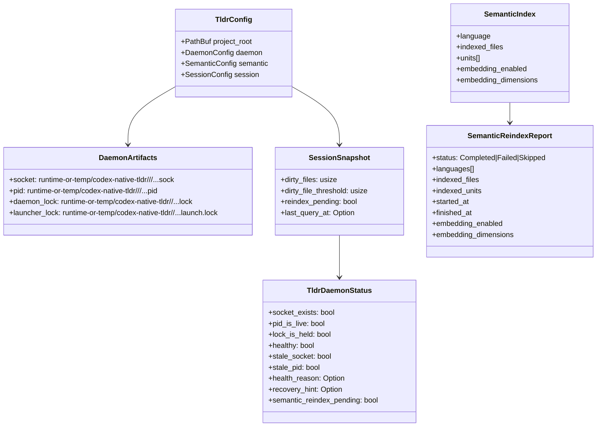
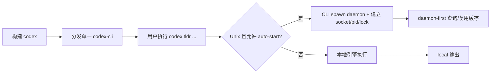

# 系统架构文档

## 文档信息
- **功能名称**：codex-cli-native-tldr
- **版本**：1.0
- **创建日期**：2026-03-26
- **作者**：Architect Agent

## 摘要

> 下游 Agent 请优先阅读本节，需要细节时再查阅完整文档。

- **架构模式**：本地单机「daemon-first」多进程架构（CLI/MCP 入口 → 可选 daemon 复用内存缓存 → 不可用则本地引擎 fallback），无数据库/无 HTTP 服务/无 UI。
- **模块边界**：`codex-native-tldr`（核心引擎/协议/生命周期）｜`codex-cli`（命令行入口、hidden `tldr internal-daemon` 与 auto-start）｜`codex-mcp-server`（MCP tool 入口，不负责 auto-start）。
- **生命周期与 artifacts**：Unix 优先使用 `$XDG_RUNTIME_DIR/codex-native-tldr/<uid>/`，否则回退到 `temp_dir()/codex-native-tldr/<uid>/`；非 Unix 使用 `temp_dir()/codex-native-tldr/`。其中 `socket/pid` 放在 `<project-hash>/` 子目录，`lock/launch.lock` 放在用户级 scope 根目录，避免项目 artifact 目录被外部删除时互斥语义一并丢失；status/health 字段对外可观测（healthy/stale_socket/stale_pid/lock_is_held + reason/hint）。
- **Semantic I/O 与缓存/reindex**：semantic 以 `language+query` 为输入，对外通过 `TldrSemanticResponseView` / `TldrDaemonResponseView` 做显式投影，只暴露稳定字段（如 `path`、`line`、`snippet`、`embedding_score`），默认不透出 `unit`、`embedding_text` 等内部重字段；索引在 `TldrEngine` 内按语言缓存，daemon 复用同一 engine 缓存；reindex 由 `session.reindex_pending` 驱动，`Warm` 会触发 `engine.semantic_reindex()` 并记录 `SemanticReindexReport`。
- **Unix 主路径与非 Unix fallback**：daemon 查询与 auto-start 当前为 Unix 主路径（Unix socket）；非 Unix 下 `query_daemon` 固定返回 `None`，CLI/MCP 走本地引擎；daemon 的 TCP 监听实现存在但当前未接入客户端查询链路。

---
---

## 1. 架构概述

### 1.1 系统架构图

```mermaid
graph TB
    subgraph Entrypoints[入口层]
        CLI[codex-cli<br/>codex tldr ...]
        MCP[codex-mcp-server<br/>tool: tldr]
    end

    subgraph Core[核心库]
        NT[codex-native-tldr<br/>TldrEngine + semantic/session + daemon protocol]
        LM[DaemonLifecycleManager<br/>query/retry/backoff/launch-dedupe(in-proc)]
    end

    subgraph Daemon[daemon 层]
        D[codex hidden internal-daemon<br/>Unix socket server]
        Sock[(runtime-or-temp/codex-native-tldr/<uid>/<project-hash>/...sock)]
        Pid[(runtime-or-temp/codex-native-tldr/<uid>/<project-hash>/...pid)]
        Lock[(runtime-or-temp/codex-native-tldr/<uid>/...lock)]
        LLock[(runtime-or-temp/codex-native-tldr/<uid>/...launch.lock)]
    end

    CLI --> NT
    MCP --> NT

    CLI --> LM
    MCP --> LM

    LM -->|query_daemon (unix only)| D
    D --> Sock
    D --> Pid
    D --> Lock
    CLI --> LLock

    CLI -->|daemon unavailable| NT
    MCP -->|daemon unavailable| NT
```

### 1.2 架构决策

| 决策 | 选项 | 选择 | 原因 |
|------|------|------|------|
| 入口形态 | CLI / MCP / HTTP | CLI + MCP | 目标是给 Codex CLI 与 MCP 客户端提供本地结构化分析能力，不引入网络服务形态。 |
| 进程模型 | 单进程 / daemon 复用 | daemon-first + fallback | daemon 复用内存索引/缓存提升重复查询性能；不可用时本地引擎保证可用性与可调试性。 |
| IPC 机制 | Unix socket / TCP / gRPC | Unix socket（主路径） | 低开销、易部署；跨进程通过按用户/项目隔离的本地 artifacts 做 liveness/stale 协调。 |
| 生命周期互斥 | 仅靠 socket 存在 / pid / lock | socket+pid + file lock + launcher lock | 增强“全局唯一启动”与 stale 清理闭环，避免并发启动互相误伤。 |
| 配置来源 | 环境变量 / 全局配置 / 项目配置 | 项目配置 `.codex/tldr.toml` | 面向项目语义：同一机器上不同项目可不同配置；便于仓库内落档与版本控制。 |
| Semantic 输出 | 直接透传内部结构 / 显式 wire 投影 | 显式 wire 投影 | 已通过 `wire.rs` 固定 `semantic/status` 的公开字段，并用 contract tests 约束不再默认透出内部重字段。 |
| 跨平台策略 | 全平台 daemon / Unix-only daemon | Unix-only daemon（当前） | query/auto-start 链路仅在 Unix 实现；非 Unix 走本地引擎，保持功能可用但不复用 daemon 缓存。 |

---

## 2. 技术栈

| 层级 | 技术 | 版本 | 说明 |
|------|------|------|------|
| 语言/运行时 | Rust + tokio | workspace 管理 | daemon/CLI/MCP 均为 Rust 实现；daemon 使用 tokio 异步 IO。 |
| 序列化 | serde / serde_json / toml | workspace 管理 | daemon 协议为 JSONL（一行一个命令/响应）；配置为 TOML。 |
| IPC | tokio::net::UnixListener/UnixStream | - | Unix 主路径；非 Unix `query_daemon` 当前固定返回 `None`。 |
| 互斥/锁 | 文件锁（`File::try_lock`） | - | daemon lock：`*.lock`；launcher lock：`*.launch.lock`。 |
| 语义索引 | `SemanticIndexer/SemanticIndex` | phase-1 | 按语言扫描源码构建 embedding-unit 风格 metadata；引擎内存缓存每种语言索引。 |
| “embedding”可观测 | token-hash 向量 + dot product | phase-1 | 非真实 embedding：对 token 做 hashing 计数向量（可配置 dims），提供 `embeddingUsed/embedding_score` 可测试字段。 |

---

## 3. 目录结构

> 仅列出本功能的真实边界与高耦合入口文件（无前端工程目录）。

```text
codex-rs/
  native-tldr/
    src/
      lib.rs                  # TldrEngine（semantic cache/reindex）与配置汇总
      config.rs               # 读取 project/.codex/tldr.toml
      daemon.rs               # daemon 协议、Unix socket server、health/status、artifact 路径规则
      lifecycle.rs            # DaemonLifecycleManager（in-proc launch dedupe/backoff）
      session.rs              # session dirty/reindex_pending + analysis cache + snapshot
      semantic.rs             # semantic index/search/reindex
      wire.rs                 # semantic/status 对外稳定 view 与 JSON payload 投影
      lang_support/           # 语言注册与支持等级
  cli/
    src/tldr_cmd.rs           # codex tldr 子命令、hidden internal-daemon、auto-start、launcher lock、输出格式
  mcp-server/
    src/tldr_tool.rs          # MCP tool: tldr（actions: semantic/status/...），不负责 auto-start
  docs/
    codex_mcp_interface.md    # MCP 接口文档（含 embedding 字段说明与 status/semantic 示例）
```

---

## 4. 数据模型

> 本节“数据模型”指：本地 artifacts（文件）+ 进程内状态（结构体），不涉及数据库。

### 4.1 实体关系图



### 4.2 数据字典

#### Artifact：`<runtime-or-temp>/codex-native-tldr/<scope>/<project-hash>/codex-native-tldr-<hash>.sock`
| 字段 | 类型 | 必填 | 默认值 | 说明 |
|------|------|------|--------|------|
| path | Path | 是 | - | Unix socket 文件；`<hash>` 为 `md5(project_root)[:8]`；`<scope>` 在 Unix 下包含 `<uid>`，优先放在 `XDG_RUNTIME_DIR`。 |

#### Artifact：`<runtime-or-temp>/codex-native-tldr/<scope>/<project-hash>/codex-native-tldr-<hash>.pid`
| 字段 | 类型 | 必填 | 默认值 | 说明 |
|------|------|------|--------|------|
| pid | string(int) | 是 | - | daemon 进程启动后写入 `std::process::id()`；退出时清理。 |

#### Artifact：`<runtime-or-temp>/codex-native-tldr/<scope>/codex-native-tldr-<hash>.lock`
| 字段 | 类型 | 必填 | 默认值 | 说明 |
|------|------|------|--------|------|
| lock file | file | 是 | - | daemon 侧互斥：`acquire_daemon_lock()` 失败则本次 daemon 直接退出（避免重复启动）；单独放在 scope 根目录，避免项目 artifact 目录被删时丢失锁状态。 |

#### Artifact：`<runtime-or-temp>/codex-native-tldr/<scope>/codex-native-tldr-<hash>.launch.lock`
| 字段 | 类型 | 必填 | 默认值 | 说明 |
|------|------|------|--------|------|
| lock file | file | 是 | - | CLI launcher 互斥：多进程同时 auto-start 时仅一个进程实际 spawn，其余等待 daemon 就绪；单独放在 scope 根目录，避免与 `socket/pid` 同目录被一起删除。 |

### 4.3 已覆盖的异常恢复矩阵（2026-03-26）

- `socket/pid` 父目录缺失：daemon/CLI 在写入前会自动 `create_dir_all`
- `launch.lock` 父目录缺失：CLI 会自动重建
- `launch.lock` 文件被外部删除：本进程的 `try_open_launcher_lock()` / `launcher_lock_is_held()` 可恢复
- `daemon lock` 文件被外部删除：`daemon_lock_is_held()` / `daemon_health()` 可恢复
- external daemon lock owner 在 mid-boot 时项目 artifact 目录被删：daemon 仍能重建 `socket/pid` 并完成启动；contender 不会重复 spawn

**仍未覆盖/待后续增强**：
- 权限异常（目录可见但不可写）
- scope 根目录被外部整体删除时，跨进程 contender 的恢复/重试语义
- scope 根目录被外部整体删除时的恢复/重试语义
- 非 Unix 路径下的等价恢复测试

#### Session 状态：`SessionSnapshot`（对外可见）
| 字段 | 类型 | 必填 | 默认值 | 说明 |
|------|------|------|--------|------|
| dirty_files | usize | 是 | 0 | 被 `Notify` 标记为 dirty 的文件计数。 |
| dirty_file_threshold | usize | 是 | 20（默认） | 超过阈值会触发 cache invalidation 并置 `reindex_pending`。 |
| reindex_pending | bool | 是 | false | phase-1 语义：需要 reindex；`Warm` 会尝试 reindex 并在成功完成时清零。 |
| last_query_at | Option<SystemTime> | 否 | null | 最近一次 daemon 查询时间（用于 status 可观测）。 |

#### Semantic 输出：`SemanticSearchResponse` + `TldrSemanticResponseView`（当前对外投影）
| 字段 | 类型 | 必填 | 默认值 | 说明 |
|------|------|------|--------|------|
| enabled | bool | 是 | false | 由 `.codex/tldr.toml` 的 `[semantic].enabled` 控制。 |
| indexed_files | usize | 是 | 0 | 本次索引覆盖的文件数量（按语言扩展名扫描）。 |
| truncated | bool | 是 | false | 若匹配结果超过 5，会截断并置 true。 |
| embedding_used | bool | 是 | false | 由 `[semantic.embedding].enabled` 决定；用于可观测字段联通（非真实 embedding）。 |
| matches | Vec<TldrSemanticMatchView> | 是 | [] | 默认仅暴露 `path/line/snippet/embedding_score`；`unit/embedding_text` 等内部字段不再对外透出。 |

---

## 5. API 设计

> 本节“API”指本地接口契约：CLI 命令、daemon JSONL 协议、MCP tool 输入输出（非 HTTP）。

### 5.1 接口概览

| 接口类型 | 名称 | 输入 | 输出 | 备注 |
|---------|------|------|------|------|
| CLI | `codex tldr languages` | - | stdout 文本 | 列出内建支持语言。 |
| CLI | `codex tldr structure/context` | `--project --lang [--json] [symbol]` | 文本或 JSON | daemon-first；不可用则本地引擎。 |
| CLI | `codex tldr semantic` | `--project --lang [--json] QUERY` | 文本或 JSON | 输出含 `embeddingUsed` 与 `matches[*].embedding_score`（若有）。 |
| CLI | `codex tldr daemon ping/warm/snapshot/status` | `--project [--json]` | 文本或 JSON | 直接与 daemon 交互（仍走 query+auto-start）。 |
| Daemon 协议 | JSONL 命令 | `TldrDaemonCommand` JSON（一行） | `TldrDaemonResponse` JSON（一行） | Unix socket 上逐行收发。 |
| MCP tool | `tldr` | `action, project?, language?, symbol?, query?, path?` | `structuredContent` + text | daemon-first；不负责 auto-start，仅 query+等待/重试。 |

### 5.2 接口详情

#### Daemon JSONL 协议（核心契约）

- **传输**：Unix socket（`/tmp/codex-native-tldr-<hash>.sock`），一行一个 JSON。
- **命令枚举**：`TldrDaemonCommand`（`serde(tag="cmd", rename_all="snake_case")`）
  - `ping`
  - `warm`
  - `analyze { key, request }`
  - `semantic { request }`
  - `notify { path }`
  - `snapshot`
  - `status`

**示例：Ping**
```json
{"cmd":"ping"}
```

**示例：Semantic**
```json
{"cmd":"semantic","request":{"language":"Rust","query":"how does login work"}}
```

**响应：TldrDaemonResponse（关键字段）**
- `status`: `"ok"`（当前实现主要返回 ok；错误以进程/解析失败体现）
- `message`: 人类可读信息
- `analysis?`: `AnalysisResponse`
- `semantic?`: `SemanticSearchResponse`
- `snapshot?`: `SessionSnapshot`
- `daemon_status?`: `TldrDaemonStatus`（含 artifact 路径、health、recovery_hint 等）
- `reindex_report?`: `SemanticReindexReport`（Warm/Status/Notify 可携带）

#### MCP Tool：`tldr`

**输入（核心字段）**：
- `action`: `"tree" | "context" | "impact" | "semantic" | "ping" | "warm" | "snapshot" | "status" | "notify"`
- `project?`: string（可选；省略则取默认项目根）
- `language?`: 语言枚举（semantic/tree/context/impact 必填）
- `symbol?`: string（分析类可选）
- `query?`: string（semantic 必填）
- `path?`: string（notify 必填）

**输出（structuredContent）**：
- analysis 类：包含 `action/project/language/source/summary/supportLevel/fallbackStrategy/...`
- semantic：包含 `embeddingUsed`、`matches` 等（当前透传）
- daemon 类：包含 `snapshot/daemonStatus/reindexReport`

---

## 6. 安全设计

### 6.1 认证方案
- **方案**：不适用（本地进程内/本地 IPC，无远程认证）。
- **边界**：信任边界以“本机用户态”与“项目目录/临时目录文件权限”为主。

### 6.2 授权模型
- **模型**：不适用传统 RBAC/ABAC。
- **实际约束点**：
  - CLI/MCP 仅在给定 `--project`（或 MCP `project`）根目录下进行源码扫描/读取（semantic 构建索引时读取源文件）。
  - daemon artifacts 现已位于按用户隔离的 runtime/temp scope 下；其中 `socket/pid` 按项目分目录，`lock/launch.lock` 放在 scope 根目录。虽然已显著降低碰撞/误删风险，但仍不是强安全隔离。

### 6.3 安全措施
- [x] **可观测的 stale 清理策略**：仅在 `lock_is_held=false` 且确认为 stale 时才清理 `socket/pid`，避免并发启动误删。
- [x] **双锁策略降低竞态**：daemon lock（避免重复启动）+ launcher lock（避免多 CLI 进程重复 spawn）。
- [ ] **（待 phase-2 前置收口）Semantic payload 控制**：当前 `matches` 透传 `EmbeddingUnit/embedding_text`，存在体积与敏感信息外泄风险；建议在 phase-2 冻结“对外 wire 投影”并默认裁剪。
- [x] **artifact 路径分层与 scope 隔离**：已切到 `runtime-or-temp/codex-native-tldr/<scope>/`，并把 `lock/launch.lock` 与项目级 `socket/pid` 解耦，降低项目 artifact 目录被删时的互斥丢失风险。
- [ ] **（待 phase-2）更强权限/恢复策略**：仍需覆盖 scope 根目录整体丢失、权限异常、以及更明确的恢复观测日志（不在本最小文档中展开实现）。

---

## 7. 部署架构

### 7.1 环境

| 环境/模式 | 用途 | 入口 | 说明 |
|------|------|-----|------|
| 本地 CLI（无 daemon） | 最小可用 | `codex tldr ...` | non-Unix 或 daemon 不可用时的默认模式：本地引擎直接执行。 |
| 本地 CLI + daemon（Unix） | 性能/复用缓存 | CLI auto-start + Unix socket | CLI 可自动重入当前 `codex` 的 hidden `tldr internal-daemon` 模式并复用缓存/索引。 |
| MCP + 外部 daemon（Unix） | Agent/客户端集成 | MCP tool `tldr` | MCP 不负责 auto-start，仅复用 query/retry/backoff 逻辑等待 daemon。 |

### 7.2 部署流程



**运行时边界说明**：
- daemon 是本地子进程，生命周期受用户 ctrl-c/进程退出影响；退出会清理自身 `socket/pid`。
- daemon 的“全局唯一启动”依赖 lock/artifact 协议而非系统服务管理（systemd/launchd 不在当前范围）。

---

## 8. 性能考虑

### 8.1 性能目标
| 指标 | 目标值 | 说明 |
|------|--------|------|
| 重复查询性能 | 优先复用 | daemon-first 复用内存中的 `SemanticIndex`（按语言缓存），减少重复扫描/解析。 |
| 结果体积 | 可控 | semantic 默认最多返回 5 条 match（`truncated=true` 表示截断）。 |
| 退化路径 | 可用且可诊断 | daemon 不可用时回退本地引擎，并在输出中标注 `source=local/daemon` 与 message。 |

### 8.2 优化策略
- [x] **按语言缓存 semantic index**：`TldrEngine` 内部 `semantic_indexes`（`language -> SemanticIndex`）复用，直到显式 `semantic_reindex()`。
- [x] **daemon 复用共享引擎**：daemon 对每个连接复用同一个 `TldrEngine`，避免连接级重建导致缓存丢失。
- [x] **reindex 闭环**：`Notify` 触发 dirty 与 `reindex_pending`，`Warm` 执行 reindex 并通过 status/report 对外可观测。
- [ ] **（待 phase-2）wire schema 收口**：semantic matches 体积与字段稳定性需要显式投影与上限策略，避免 MCP 结构化输出过大。

---

## 变更记录

| 版本 | 日期 | 作者 | 变更内容 |
|------|------|------|----------|
| 1.0 | 2026-03-26 | Architect Agent | phase-2 入场前最小架构文档：明确模块边界、生命周期 artifacts、semantic I/O 与缓存/reindex、Unix 主路径与非 Unix fallback、测试/部署边界。 |
