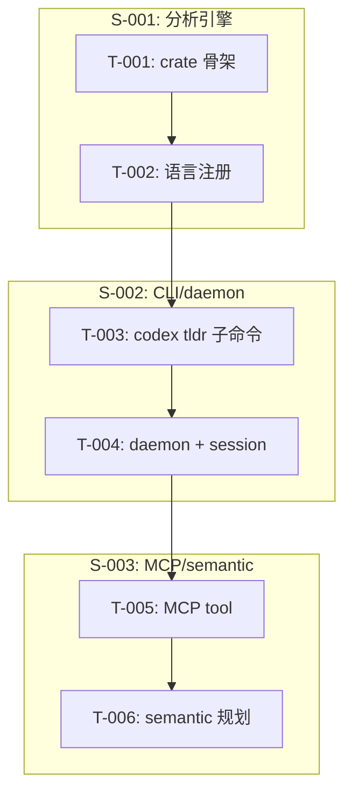

# 开发任务规格文档

## 文档信息
- **功能名称**：codex-cli-native-tldr
- **版本**：1.0
- **创建日期**：2026-03-25
- **作者**：Scrum Master Agent
- **关联故事**：`.agents/codex-cli-native-tldr/prd.md`

## 摘要

> 下游 Agent 请优先阅读本节，需要细节时再查阅完整文档。

- **任务总数**：6 个
- **前端任务**：0 个（CLI 主要为后端处理）
- **后端任务**：6 个
- **关键路径**：T-001 → T-002 → T-003 → T-004 → T-005 → T-006
- **预估复杂度**：高

---

## 0. 当前执行进度（实时）

- **当前阶段**：Stage 3 / 执行中（新一轮并行：补 semantic MCP e2e + 评估 daemon 生命周期）
- **已完成任务**：
  - `T-001` crate 骨架完成，提交 `4c9b8d870`
  - `T-002` 首批 7 语言注册与 parser 接入完成，提交 `99120d35c`
  - `T-003` `codex tldr` 子命令骨架完成，提交 `91880934c`
  - `T-004` session/daemon server 骨架完成，提交 `0c27160c6`
  - `T-005` MCP `tldr` tool 注册、schema、handler 与文档接入完成，提交 `facc10ad7`
  - `T-006` 第一阶段 semantic placeholder 完成，提交 `b83144203`
- **当前正在做**：
  - 会话 A：补 `semantic` 的 MCP 端到端验证
  - 会话 B：评估 daemon 生命周期与外部进程策略
  - 主线程：整合并行结果、复测、继续同步 `.agents` 文档
- **刚完成**：
  - CLI `codex tldr structure/context` 在 daemon 不可用时尝试自动启动 `codex-native-tldr-daemon` 并重试，提交 `3e640e4d4`
  - MCP `warm` / `notify` / `snapshot` 端到端测试
  - MCP `tldr` daemon 可用路径测试（真实 Unix socket mock）
  - `SemanticIndexer` placeholder、配置链式 API、单测
  - MCP `tldr semantic` structuredContent 定向测试
- **紧随其后**：
  - `semantic` / daemon 外部进程启动路径的进一步端到端覆盖
  - daemon 生命周期、跨平台 auto-start 与 MCP 协同策略补齐
- **已知阻塞**：
  - `just argument-comment-lint` 依赖脚本 `./tools/argument-comment-lint/run-prebuilt-linter.sh` 缺失
  - `just bazel-lock-check` 依赖脚本 `./scripts/check-module-bazel-lock.sh` 缺失

## 1. 任务概览

### 1.1 统计信息
| 指标 | 数量 |
|------|------|
| 总任务数 | 6 |
| 创建文件 | 4 |
| 修改文件 | 3 |
| 测试用例 | 6+ |

### 1.2 任务分布
| 复杂度 | 数量 |
|--------|------|
| 低 | 1 |
| 中 | 2 |
| 高 | 3 |

---

## 2. 任务详情

### Story: S-001 - 构建 codex-native-tldr 分析引擎

----

#### Task T-001：创建 codex-native-tldr crate 骨架

**类型**：创建

**目标文件**：
| 文件路径 | 操作 | 说明 |
|----------|------|------|
| `codex-native-tldr/Cargo.toml` | 创建 | 注册 workspace crate，依赖 tokio、tree-sitter、file-search、serde |
| `codex-native-tldr/src/lib.rs` | 创建 | 暴露分析 API、builder，托管 session 与 daemon 模块 |
| `codex-native-tldr/src/api/mod.rs` | 创建 | 定义 AST、调用图、CFG、DFG、PDG 的入口接口 |

**实现步骤**：
1. 在 `codex-rs/Cargo.toml` 与对应 Bazel BUILD 中加入新 crate，设置 `edition = "2024"`；引入 `tree-sitter`, `ignore`, `anyhow`, `serde`, `tokio` 等基础依赖。
2. 按 `api/`, `lang_support/`, `session.rs`, `daemon.rs`, `mcp.rs`, `semantic.rs` 构建模块骨架，`lib.rs` 提供 `TldrEngine` 入口并 re-export 关键类型。
3. 先实现 stub 方法，确保 `cargo check -p codex-native-tldr` 不报错，为后续分步填充留出接口。

**测试用例**：
| 用例 ID | 描述 | 类型 |
|---------|------|------|
| TC-T001-1 | `cargo check -p codex-native-tldr` | 构建验证 |
| TC-T001-2 | `cargo test -p codex-native-tldr --lib`（空测试） | 单元测试 |

**复杂度**：高

**依赖**：无

**注意事项**：新增 crate 要在 workspace 共享的 `codex-rs/.cargo/config.toml` 保持一致依赖版本。

**完成标志**：
- [x] crate 可编译 + 与 Bazel rules 集成
- [x] 模块目录与公共类型文档到位

----

#### Task T-002：实现语言支持注册与树形解析器

**类型**：创建/修改

**目标文件**：
| 文件路径 | 操作 | 说明 |
|----------|------|------|
| `codex-native-tldr/src/lang_support/mod.rs` | 创建 | 提供 `LanguageRegistry`，封装 parser 初始化与缓存 |
| `codex-native-tldr/src/lang_support/{rust,typescript,python,go,php,javascript,zig}.rs` | 创建 | 每种语言 parser 的 helper 与抓取调用信息函数 |
| `codex-native-tldr/src/api/call_graph.rs` | 修改 | 通过 registry 区分语言生成 `FunctionRef` 和 `CallEdge` |

**实现步骤**：
1. 实现 `LanguageRegistry::get_parser(lang)`，内部按语言缓存 `tree-sitter` parser；加入 `lazy_static` 或 `once_cell` 保证 thread-safe。
2. 为 Rust、TS、Python、Go、PHP、JS、Zig 提供最小 parser wrapper，统一返回 AST 节点与调用信息。
3. 修改 call graph 模块，使用 registry 输出 `FunctionRef`，并为 CFG/DFG 模块提供语言-agnostic 接口。

**测试用例**：
| 用例 ID | 描述 | 类型 |
|---------|------|------|
| TC-T002-1 | 7 个语言的示例代码调用 registry，断言成功构造 parser | 单元测试 |
| TC-T002-2 | `cargo test -p codex-native-tldr lang_support`，验证 parser 结果不为空 | 单元测试 |

**复杂度**：高

**依赖**：T-001

**注意事项**：确保 `tree-sitter` parser 安全初始化、错误信息可诊断；Zig parser 可能需要自建 grammar crate。

----

### Story: S-002 - CLI/daemon 集成与缓存

----

#### Task T-003：在 codex-cli 中注册 `codex tldr` 子命令

**类型**：修改

**目标文件**：
| 文件路径 | 操作 | 说明 |
|----------|------|------|
| `codex-cli/src/commands/mod.rs` | 修改 | 注册 `tldr` 命令及 help 文案 |
| `codex-cli/src/commands/tldr.rs` | 创建 | 解析 `--lang`/`--project`/`--semantic` 等参数，调用 `codex-native-tldr` lib |
| `codex-cli/src/config.rs` | 修改 | 增加 `[tldr]` 配置，包含 daemon auto-start、semantic gate、ignore patterns |

**实现步骤**：
1. 增加 Clap 子命令与参数，保持与 `rtk` `command.rs` 结构一致。
2. 命令 handler 在本地先询问 config，若 daemon 可用则发送 `context/tree/semantic` 请求，否则调用 `codex-native-tldr` 直接执行。
3. 输出 JSON + summary 供 CLI/TUI/agent 使用，记录 token 统计并可选写入 `stats` 模块。

**测试用例**：
| TC-T003-1 | `cargo test -p codex-cli command_tldr_parses` | 单元测试 |
| TC-T003-2 | `cargo test -p codex-cli command_tldr_help`（`--help` 不 panic） | 单元测试 |

**复杂度**：中

**依赖**：T-001、T-002

**注意事项**：命令需支持 `--project` 与 `.tldrignore`，并在 `config.schema.json` 中补 `tldr` 字段。

----

#### Task T-004：实现分析 daemon 与 session 缓存

**类型**：创建

**目标文件**：
| 文件路径 | 操作 | 说明 |
|----------|------|------|
| `codex-native-tldr/src/session.rs` | 创建 | 维护 dirty list、content-hash index 与 memoization |
| `codex-native-tldr/src/daemon.rs` | 创建 | tokio socket server，接受 `warm`, `context`, `slice`, `semantic` 命令 |
| `codex-native-tldr-daemon/src/main.rs` | 创建 | 启动 daemon、写 socket path、处理 pidfile |

**实现步骤**：
1. 设计 `Session` 结构，包含 `cache: HashMap<String, AnalysisResult>`, `dirty_count`, `last_query_at`, 以及 reindex trigger。
2. Daemon 监听 UNIX/TCP socket，接收到命令后调用对应 handler，维护 `ContentHashedIndex`；响应包含 `status`, `payload`。
3. CLI 在 daemon 不活跃时自动启动守护进程，确保 `codex tldr` 命令可以快速复用内存索引。

**测试用例**：
| TC-T004-1 | 单元测试 `Session` 缓存命中/失效逻辑 | 单元测试 |
| TC-T004-2 | 集成测试启动 daemon 并发送 `ping`、`context`，检查返回 `status:ok` | 集成测试 |

**复杂度**：高

**依赖**：T-001、T-002、T-003

**注意事项**：daemon 需要跨平台 socket（Unix + Windows），并且 session stats 需可供 `codex stats` 查看。

----

### Story: S-003 - MCP 与 semantic 阶段

----

#### Task T-005：将 `tldr` 功能注册为 MCP tool

**类型**：修改

**目标文件**：
| 文件路径 | 操作 | 说明 |
|----------|------|------|
| `codex-rs/mcp-server/src/tools.rs` | 修改 | 注册 `tldr` tool，指向新 handler |
| `codex-rs/mcp-server/src/tools/tldr.rs` | 创建 | 解析 MCP 请求，调用 daemon handler 并返回统一结构 |

**实现步骤**：
1. 在 MCP server 注册 `tldr` tool，支持 `tree`, `context`, `impact`, `semantic` 指令。
2. Handler 与 `codex-native-tldr::mcp` 模块对接，通过 socket 与 daemon 通信，统一 response schema。
3. 编写 doc 说明 `codex tldr` CLI 与 MCP tool 的一致输出模式。

**测试用例**：
| TC-T005-1 | 单元测试 `tldr` tool 解析并调用 daemon mock | 单元测试 |
| TC-T005-2 | 使用 `codex mcp-server --tool tldr` 发送 `ping`，验证 `status:ok` | 集成测试 |

**复杂度**：中

**依赖**：T-003、T-004

**注意事项**：确保 MCP tool 对应的 JSON schema 与 CLI 输出一致，便于 agent 共享。

----

#### Task T-006：semantic search 阶段规划与 placeholder

**类型**：创建

**目标文件**：
| 文件路径 | 操作 | 说明 |
|----------|------|------|
| `codex-native-tldr/src/semantic.rs` | 创建 | 实现 `EmbeddingUnit` + `build_embedding_text` + FAISS metadata schema |
| `codex-native-tldr/src/config.rs` | 修改 | 增加 `semantic.enabled`, `semantic.model`, `semantic.auto_reindex_threshold` |

**实现步骤**：
1. 定义 `SemanticConfig`，并在 config schema 中新增 `[tldr.semantic]`，默认关闭 embedding 模型。
2. 提供 placeholder `SemanticIndexer::start` 仅在 `semantic.enabled` 为 `true` 时启用，并输出 metadata（语言、cfg/dfg summary）。
3. Semantic 模块在 daemon 中注册 background task，只记录 reindex 触发逻辑，实际 embedding pipeline 需后续填充。

**测试用例**：
| TC-T006-1 | 单元测试 `SemanticConfig::from_config` 正确读取开关 | 单元测试 |
| TC-T006-2 | CLI `codex tldr --semantic` 触发 `semantic.enabled` 布尔路径 | 集成测试 |

**复杂度**：中

**依赖**：T-001、T-002、T-003

**注意事项**：保持 semantic 依赖（如 huggingface 模型）为 optional，以免首次编译拉取 1.3GB 包。

---

## 3. 实现前检查清单

在开始实现前，确保：

- [x] 已阅读 PRD / 架构 / Tech Lead 评审文档
- [x] 理解 `codex-cli`、`codex-mcp-server` 与目标 `codex-native-tldr` 的代码节奏
- [x] Rust + Bazel 构建链可用，`cargo test -p xxx` 无障碍（局部验证已完成）
- [ ] `config.schema.json` 包含 `[tldr]` 与 `[tldr.semantic]` 定义
- [ ] semantic search 默认关闭，需通过 config flag 明确开启

## 4. 任务依赖图

## 5. 文件变更汇总

### 5.1 新建文件
| 文件路径 | 关联任务 | 说明 |
|----------|----------|------|
| `codex-native-tldr/Cargo.toml` | T-001 | 注册新的分析 crate |
| `codex-native-tldr-daemon/src/main.rs` | T-004 | 启动守护进程 |
| `codex-rs/mcp-server/src/tools/tldr.rs` | T-005 | MCP tool handler |
| `codex-native-tldr/src/semantic.rs` | T-006 | Semantic placeholder 模块 |

### 5.2 修改文件
| 文件路径 | 关联任务 | 变更类型 |
|----------|----------|----------|
| `codex-native-tldr/src/lib.rs` | T-001 | 暴露分析 API |
| `codex-cli/src/commands/mod.rs` | T-003 | 注册 `tldr` 命令 |
| `codex-cli/src/config.rs` | T-003 | 添加 `tldr` 配置 |

### 5.3 测试文件
| 文件路径 | 关联任务 | 测试类型 |
|----------|----------|----------|
| `codex-native-tldr/tests/lang_support.rs` | T-002 | 语言解析单元测试 |
| `codex-cli/tests/command_tldr.rs` | T-003 | CLI 命令测试 |
| `codex-native-tldr/tests/session.rs` | T-004 | session 缓存测试 |

## 6. 代码规范提醒

### Rust
- 遵循 codex-rs 的 lint 规则（format! inline, collapse-if）
- 语言注册和 daemon 模块使用 `tokio` + `async` 模式
- 目录按 `api`, `lang_support`, `session`, `daemon`, `mcp`, `semantic` 拆分

### CLI
- `codex tldr` 命令通过 `clap` derive，并公开 `--help` 与 `--version`
- 新 config 字段同步 `config.schema.json` 和 `docs/config.md`
- MCP handler 输出与 CLI JSON 保持一致，便于 agent 复用

### 测试
- 每个 crate 都需 `cargo test -p <crate>` 覆盖新增模块
- semantic 模块目前只做 config gating 单元测试，避免拉大模型

## 变更记录

| 版本 | 日期 | 作者 | 变更内容 |
|------|------|------|----------|
| 1.0 | 2026-03-25 | Scrum Master Agent | 拆解任务，包含 CLI、daemon、MCP 与 semantic 规划 |
