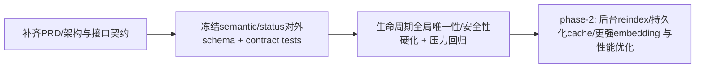

# 技术方案评审报告

## 1. 评审概述

- **项目名称**：codex-cli-native-tldr
- **评审日期**：2026-03-26
- **评审人**：Tech Lead Agent
- **评审文档**：
  - phase-1 稳定化需求确认：`.agents/specs/native-tldr-phase1-stabilization/requirements-confirm.md`
  - embedding 可观测性需求确认：`.agents/specs/native-tldr-embedding-observability/requirements-confirm.md`
  - 任务拆解与进度记录：`.agents/codex-cli-native-tldr/tasks.md`
  - QA 验证与回归记录：`.agents/codex-cli-native-tldr/qa-report.md`
  - 代码与对外文档快照（节选）：`codex-rs/native-tldr/*`、`codex-rs/cli/src/tldr_cmd.rs`、`codex-rs/mcp-server/src/tldr_tool.rs`、`codex-rs/docs/codex_mcp_interface.md`
  - 说明：骨架中引用的 `.agents/codex-cli-native-tldr/prd.md`、`.agents/codex-cli-native-tldr/architecture.md`、`.agents/codex-cli-native-tldr/ui-spec.md` 当前不存在，本次评审仅能基于“需求确认 + tasks/QA + 代码快照”进行；涉及 PRD/架构的部分以“阻塞项/假设”形式上升

## 摘要

> 下游 Agent 请优先阅读本节，需要细节时再查阅完整文档。

- **评审结论**：⚠️ 有条件通过（phase-1 已基本落地、且已有定向回归；进入 phase-2 前需先补齐关键文档与接口契约）
- **主要风险**：
  1) `.agents` 侧 PRD/架构缺失，导致 phase-2 目标、边界与验收口径难以稳定继承
  2) semantic `matches` 当前直接透传 `SemanticMatch`，对 MCP/CLI 的稳定性、性能与文档一致性存在风险
  3) daemon 生命周期“跨进程全局唯一启动”已增强但仍偏工程化闭环，在崩溃/抢占/多用户环境下仍需进一步硬化
- **必须解决**：
  - 补齐并冻结 phase-2 所需的 PRD/架构最小集（至少：目标、非目标、接口契约、失败与恢复语义、兼容策略）
  - 明确并收口 `semantic` 的对外 wire schema（至少：哪些字段稳定、哪些字段可选/可裁剪、payload 上限与脱敏策略）
- **建议优化**：
  - 继续加固 daemon artifact（socket/pid/lock）路径与权限策略；当前已完成 uid/scope 隔离，并把 `lock/launch.lock` 脱离项目 artifact 目录，但权限异常与 scope 根目录整体丢失仍待覆盖
  - 拆分 `codex-rs/native-tldr/src/daemon.rs` 与 `codex-rs/native-tldr/src/semantic.rs`，并补充“崩溃/并发启动/脏文件阈值触发 reindex”等压力型回归
- **技术债务**：
  - `codex-rs/native-tldr/README.md` 已回写到当前实现，但 `.agents` / MCP 文档 / README 之间仍需持续同步，避免下一轮 schema 或 lifecycle 变更再次漂移
  - 仓库工具链/Justfile 相关脚本存在缺失记录（`just argument-comment-lint`、`just bazel-lock-check`），影响质量门禁可复现性

---

  - PRD：`.agents/codex-cli-native-tldr/prd.md`（缺失）
  - 架构：`.agents/codex-cli-native-tldr/architecture.md`（缺失）
  - UI 规范：`.agents/codex-cli-native-tldr/ui-spec.md`（缺失；本功能以 CLI/MCP 为主可接受，但需明确“无 UI”结论并在文档里落档）

## 2. 评审结论

| 维度 | 评分 | 说明 |
|------|------|------|
| 架构合理性 | ⭐⭐⭐⭐☆ | `codex-native-tldr` 作为核心，CLI/MCP 作为入口，daemon 优先且本地 fallback，分层基本清晰；主要问题是对外 schema 未冻结，且关键架构文档缺失。 |
| 技术选型 | ⭐⭐⭐⭐⭐ | Rust + tokio + serde + Unix socket/file lock 适合本地 daemon、结构化输出、高可测回归的目标。 |
| 可扩展性 | ⭐⭐⭐⭐☆ | `TldrEngine` 已有按语言缓存的 `SemanticIndex`，daemon 可复用共享 engine，适合作为 phase-2 背景 reindex/持久化缓存/更强 embedding 的起点。 |
| 可维护性 | ⭐⭐⭐☆☆ | 核心逻辑集中在 `daemon.rs`、`semantic.rs`、`tldr_cmd.rs` 等高触达文件，且 README 与实现漂移。 |
| 安全性 | ⭐⭐⭐☆☆ | daemon 元数据现已切到按用户 scope 隔离，并把 `lock/launch.lock` 与项目 artifact 目录解耦；但权限异常、scope 根目录整体丢失、以及 semantic 输出 payload 限制仍未完全收口。 |

**总体评价**：⚠️ 有条件通过（允许进入 phase-2 规划与实现，但需先完成阻塞项以避免接口与协作风险放大）

## 3. 技术风险评估

| 风险 | 等级 | 影响范围 | 缓解措施 |
|------|------|----------|----------|
| `.agents` 关键文档缺失（PRD/架构/UI spec）导致 phase-2 目标与接口契约不可追溯 | 高 | 需求管理、跨 Agent 协作、验收口径 | 进入 phase-2 前补齐最小 PRD/架构：明确目标/非目标、接口契约、失败与恢复语义、兼容策略，并在 tech-review/tasks/QA 之间建立追踪关系。 |
| semantic 输出 schema 与 payload 风险（`matches` 透传包含较大字段；字段命名存在 camelCase + snake_case 混用） | 中 | MCP 客户端兼容性、网络/存储开销、未来演进成本 | 定义稳定 response struct，只暴露必要字段；为调试字段加开关；明确命名规范并补充 contract test 与文档示例。 |

## 4. 技术可行性分析

### 4.1 核心功能可行性

| 功能 | 可行性 | 复杂度 | 说明 |
|------|--------|--------|------|
| phase-1 daemon 生命周期稳定化（lock/liveness/stale 闭环 + status 可观测） | ✅ 可行 | L | 代码已落地，且 QA 已覆盖多进程竞争与 stale 清理关键路径。 |
| semantic phase-1 + embedding 可观测性（CLI/MCP/doc/test） | ✅ 可行 | M | 代码已落地，CLI/MCP 已显式输出 `embeddingUsed`，MCP e2e 已断言 `embedding_score`。 |

### 4.2 技术难点

| 难点 | 解决方案 | 预估工时 |
|------|----------|----------|
| 跨进程“全局唯一启动”与崩溃恢复进一步硬化 | 在现有 lock/pid/socket 闭环上补齐更强 artifact 所属校验、路径隔离与压力回归。 | 4-7 天 |
| semantic 对外 schema 冻结与 payload 控制 | 定义稳定 wire schema，在 CLI/MCP 做显式投影；引入 payload 上限/截断策略，并补充文档与 contract tests。 | 5-10 天 |

## 5. 架构改进建议

### 5.1 必须修改（阻塞项）

- [ ] **补齐 `.agents/codex-cli-native-tldr/` 的 PRD/架构最小集并与实现对齐**：至少落档接口与 schema、失败/恢复语义（stale/lock/backoff）、跨平台策略（Unix/非 Unix fallback）、可观测性与测试策略。
- [ ] **冻结并收口 semantic 的对外 schema**：当前直接透传 `SemanticMatch` 可能包含大字段，进入 phase-2 前应明确哪些字段稳定可依赖，并默认输出精简结构。

### 5.2 建议优化（非阻塞）

- [ ] **继续加固 daemon artifact 路径与权限策略**：uid/scope 隔离与 lock 分层已落地；下一步聚焦权限异常、scope 根目录整体丢失、以及更明确的清理/恢复观测日志。
- [ ] **拆分大模块并增加压力回归**：按“协议/IO/状态机/索引/输出格式化”拆分 `daemon.rs`、`semantic.rs`、`tldr_cmd.rs` 等模块，并补充 crash/并发启动/阈值触发 reindex 的压力测试。

## 6. 实施建议

### 6.1 开发顺序建议



### 6.2 里程碑建议

| 里程碑 | 内容 | 建议工时 | 风险等级 |
|--------|------|----------|----------|
| M1 | 补齐 `.agents` PRD/架构最小集；更新 `codex-rs/native-tldr/README.md` 与当前实现一致；明确“无 UI”并落档 | 1-2 天 | 低 |
| M2 | 冻结 semantic/status 的对外 schema；新增 contract tests；默认精简 payload + 上限策略 | 5-10 天 | 中 |
| M3 | 生命周期唯一性进一步硬化（uid/runtime dir/崩溃恢复语义）+ semantic 后台 reindex/持久化/更强 embedding 路径 | 2-4 周 | 高 |

### 6.3 技术债务预警

| 潜在债务 | 产生原因 | 建议处理时机 |
|----------|----------|--------------|
| 文档与实现漂移（`codex-rs/native-tldr/README.md`、MCP 接口文档对 match 字段描述不完整） | phase-1 快速迭代后未系统回写 docs | M1 |
| 关键逻辑集中在大文件 + 输出投影缺失（daemon/semantic/CLI/MCP） | 为快速落地把协议/状态/输出混在一起 | M2 |

## 7. 代码规范建议

### 7.1 目录结构规范

```
codex-rs/native-tldr/src/
  lib.rs
  config.rs
  lifecycle.rs
  session.rs
  daemon.rs          # 建议 phase-2 拆分为 daemon/{protocol,server,health,paths}.rs
  semantic.rs        # 建议 phase-2 拆分为 semantic/{index,rank,extract,wire}.rs
  api/
  lang_support/

codex-rs/cli/src/
  tldr_cmd.rs        # 建议后续拆分：output(json/text)/lifecycle/commands

codex-rs/mcp-server/src/
  tldr_tool.rs       # 建议后续拆分：actions/daemon-query/semantic-wire
```

### 7.2 命名规范

- **文件命名**：Rust 模块文件使用 `snake_case.rs`；复杂域建议用目录拆分并以子模块承载
- **组件命名**：对外 wire struct 使用清晰的 `*Request/*Response/*Status/*Report`，避免直接透传内部结构体
- **函数命名**：优先 `query_* / ensure_* / cleanup_* / build_*` 这类显式动词命名
- **变量命名**：避免长函数中使用含义过泛的 `config/file/parsed` 命名；对锁/健康/清理三态保持语义明确

### 7.3 代码风格

- 优先“显式可观测”而非静默吞错：对等待/清理/回退等生命周期决策统一产出可诊断信息。
- 避免接口漂移与命名混用：对外 JSON 字段建议统一命名规范，并通过显式投影稳定接口。

## 8. 评审结论

- **是否通过**：⚠️ 有条件通过
- **阻塞问题数**：2 个
- **建议优化数**：2 个
- **下一步行动**：先完成 M1（补齐 PRD/架构最小集 + README 对齐）与 M2（冻结 semantic/status wire schema + contract tests + payload 收口），再进入 phase-2 的后台 reindex/持久化/更强唯一性硬化等开发。
