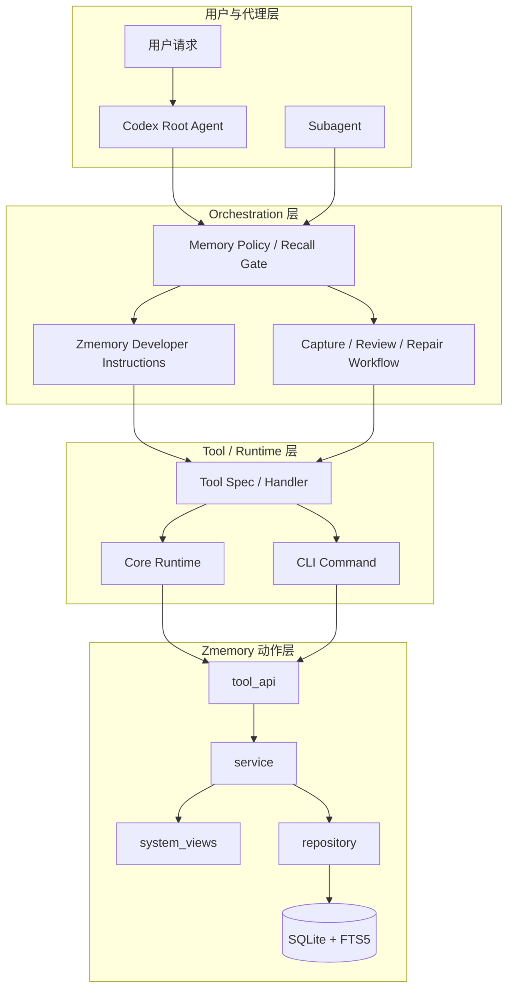

# 系统架构文档

## 文档信息
- **功能名称**：embedded-zmemory-overhaul
- **版本**：1.0
- **创建日期**：2026-03-30
- **作者**：Architect Agent

## 摘要

> 下游 Agent 请优先阅读本节，需要细节时再查阅完整文档。

- **架构模式**：内置式 Rust 单体能力增强，在 `codex-zmemory` 保持 embedded/local 动作层，在 `codex-core` 增加 memory orchestration 与 policy 层。
- **技术栈**：Rust + `codex-zmemory` + `codex-core` + `codex-cli` + SQLite/FTS5；不引入 daemon、REST、独立服务。
- **核心设计决策**：将问题拆成三层解决：`orchestrator`（何时 recall/write）、`governance`（boot/domain/URI/alias/trigger）、`diagnostics`（review/admin/current-workspace-vs-default semantics）。
- **实施状态（2026-03-31）**：M1 已落地 recall gate、root/subagent memory 协议、`system://defaults|workspace`、CLI `export defaults|workspace` 与 core e2e；当前治理桥接仍采用 `stats/doctor/system://alias` 驱动的显式修复，而不是自动迁移。
- **主要风险**：prompt 过强导致过度 recall、治理规则与实际节点脱节、默认产品事实与当前工作区事实混淆、subagent 写入污染 durable memory。
- **项目结构**：重点改造 `codex-rs/core/src/codex.rs`、`codex-rs/core/src/memories/prompts.rs`、`codex-rs/core/templates/memories/zmemory_instructions.md`、`codex-rs/core/src/tools/spec.rs`、`codex-rs/zmemory/src/service.rs`、`codex-rs/zmemory/src/system_views.rs`、`codex-rs/cli/src/zmemory_cmd.rs`。

---
---

## 1. 架构概述

### 1.1 问题定义

当前内置 `zmemory` 已具备较完整的动作层能力：`read/search/create/update/delete-path/add-alias/manage-triggers/stats/doctor/export`，但仍未形成“编码协作型长期记忆系统”的稳定产品体验。核心问题不是存储失效，而是系统缺少统一的内置编排。

具体表现为：

1. **recall 没有被强约束执行**
   - root session 只被提示 “first try read system://boot”
   - 遇到配置、历史约定、项目事实问题时，模型仍容易直接查文档
2. **boot 不是坏了，而是不够成为可靠入口**
   - 当前 `system://boot` 只返回已存在锚点
   - 默认锚点可能缺失，导致 boot 信息天然不完整
3. **记忆治理偏“文档摘要”，不够“问答知识库”**
   - 关键节点缺自然问法 alias / trigger / 中文关键词
   - search 命中依赖技术摘要措辞，用户真实问法召回弱
4. **产品默认值与工作区实际值容易混淆**
   - 例如默认 workspace-hash DB 与显式 `zmemory_path` 覆盖
   - 若回答前不先区分“产品默认行为”和“当前工作区事实”，极易答错
5. **review/admin 能力存在，但没有进入默认工作流**
   - `stats/doctor/export alias/glossary/recent` 已存在
   - 但更像原语，不像持续治理闭环

### 1.2 设计目标

本次重构目标不是新增更多底层 CRUD API，而是把内置 `zmemory` 提升为**编码协作型长期记忆系统**，做到：

- 回答长期上下文问题前，优先走 memory recall，而不是文档检索
- `system://boot` 只承载最小高价值协作记忆，不污染上下文
- 仓库知识、排障结论、架构约束进入显式项目域，按需召回
- 通过 URI、alias、trigger、priority、disclosure 建立可解释、可演化的工程记忆网络
- 明确区分：
  - 产品默认事实
  - 当前工作区实际运行事实
  - 临时会话态信息
- 保持 embedded/local，不把 `zmemory` 变成新的 daemon/REST 系统

### 1.3 非目标

本次明确不做：

- 不引入 daemon / REST / 独立 memory service
- 不把 `zmemory` 变成另一个 RTK 风格命令系统
- 不替换现有 `core/memories` 的所有摘要流程
- 不把临时会话 handoff 强塞进 durable memory
- 不追求和 upstream memory skill 的所有接口完全 parity

### 1.4 系统架构图



### 1.5 架构决策

| 决策 | 选项 | 选择 | 原因 |
|------|------|------|------|
| 总体模式 | 继续工具化 / 内置编排增强 / 外置服务化 | 内置编排增强 | 底层动作层已足够，缺的是产品级编排 |
| 运行形态 | embedded/local / daemon / REST | embedded/local | 保持低复杂度、低延迟、强可审计 |
| recall 触发方式 | 纯 prompt 建议 / runtime hard gate / 全自动后台 recall | runtime hard gate + 有界自动 recall | 比纯 prompt 稳定，又比全自动后台更可控 |
| boot 设计 | 继续通用锚点 / 扩大 boot / 最小编码协作 boot | 最小编码协作 boot | 减少上下文污染，提升启动命中率 |
| 领域模型 | 仅 core / core+project+notes / 任意自由域 | core+project+notes | 贴合编码协作长期记忆结构 |
| 与 RTK 的关系 | 完全模仿 / 局部借鉴 / 完全独立 | 局部借鉴 | 借鉴运行时编排，不照搬命令式模型 |

---

## 2. 技术栈

| 层级 | 技术 | 版本 | 说明 |
|------|------|------|------|
| 核心运行时 | Rust | workspace | 保持现有仓库技术栈 |
| 动作层 | `codex-zmemory` | workspace | 继续承载 CRUD/search/review/system view |
| 编排层 | `codex-core` | workspace | 新增 recall/capture/review policy |
| 命令入口 | `codex-cli` | workspace | 暴露治理与调试能力，不承担核心编排 |
| 存储 | SQLite + FTS5 | bundled | 保持本地单文件与全文检索 |
| 可观测性 | `stats/doctor/export/pathResolution` | workspace | 统一诊断与 review 信号 |

### 2.1 技术原则

1. **动作层稳定**
   - `codex-zmemory` 继续做稳定、本地、可审计的动作层
2. **编排层上移**
   - “什么时候用 memory”放进 `codex-core`
3. **治理层显式化**
   - alias/trigger/boot/domain 结构化管理
4. **默认事实与当前事实分层**
   - 不允许继续混写
5. **只做编码协作型记忆**
   - 不走人格陪伴型 memory 方向

---

## 3. 目录结构

### 3.1 代码改造关注目录

```text
codex-rs/
├── core/
│   ├── src/
│   │   ├── codex.rs
│   │   ├── memories/
│   │   │   ├── prompts.rs
│   │   │   └── ...
│   │   └── tools/
│   │       ├── spec.rs
│   │       └── handlers/zmemory.rs
│   └── templates/
│       └── memories/
│           └── zmemory_instructions.md
├── zmemory/
│   ├── src/
│   │   ├── tool_api.rs
│   │   ├── service.rs
│   │   ├── system_views.rs
│   │   ├── config.rs
│   │   ├── repository.rs
│   │   └── path_resolution.rs
│   └── README.md
└── cli/
    └── src/
        ├── main.rs
        └── zmemory_cmd.rs
```

### 3.2 记忆域与 URI 结构

推荐将编码记忆从“泛化 durable note”收敛成以下三层：

```text
core://agent/coding_operating_manual
core://my_user/coding_preferences
core://agent/my_user/collaboration_contract

project://<repo>/architecture
project://<repo>/module_map
project://<repo>/testing
project://<repo>/build_and_run
project://<repo>/review_rules
project://<repo>/common_pitfalls
project://<repo>/active_memory_runtime

notes://<repo>/<topic>
notes://<repo>/<incident>
notes://<repo>/<migration>
```

### 3.3 结构分层原则

- `core://...`
  - 跨仓库稳定协作规则
  - 适合进入 `system://boot`
- `project://...`
  - 仓库级长期知识
  - 按需召回，不默认启动全注入
- `notes://...`
  - 可复用但阶段性较强的观察/排障结论
  - 不默认进入 boot

---

## 4. 数据模型

### 4.1 boot 模型

推荐 `CORE_MEMORY_URIS` 最小化为 3 条：

```text
core://agent/coding_operating_manual
core://my_user/coding_preferences
core://agent/my_user/collaboration_contract
```

三者职责分别为：

1. `core://agent/coding_operating_manual`
   - 代理编码工作法
   - 如：先验证再汇报、先读再改、优先 root cause、不造假成功、不加 silent fallback
2. `core://my_user/coding_preferences`
   - 用户稳定偏好
   - 如：中文回复、简洁、默认最小改动、默认验证策略
3. `core://agent/my_user/collaboration_contract`
   - 协作协议
   - 如：何时先 plan、何时可直接改、失败如何升级攻击层级、如何声明未验证项

### 4.2 默认事实与当前工作区事实分层

必须显式区分两类 durable memory：

#### A. 产品默认事实
例如：
- 默认数据库解析行为
- 默认 boot anchors
- 默认 valid domains
- `system://boot` 只返回已存在锚点
- review 入口有哪些

建议路径：

```text
core://agent/zmemory_product_defaults
core://agent/zmemory_recall_policy
core://agent/zmemory_review_playbook
```

#### B. 当前工作区实际事实
例如：
- 当前工作区是否显式设置了 `zmemory_path`
- 当前实际 `dbPath/source/reason`
- 当前仓库使用哪些 project 域节点
- 当前仓库 memory boot 是否完整

建议路径：

```text
project://<repo>/active_memory_runtime
project://<repo>/memory_bootstrap_state
project://<repo>/memory_default_vs_workspace_diff
```

### 4.3 alias / trigger / query 建模

每个高价值节点必须至少满足以下之一：
- 有自然语义 alias
- 有中英文 trigger
- 两者都有

示例：

| 节点 | alias 示例 | trigger 示例 |
|------|------------|-------------|
| `core://agent/zmemory_product_defaults` | `alias://memory/default-behavior` | `zmemory defaults`, `默认锚点`, `boot anchors` |
| `project://repo/active_memory_runtime` | `alias://workspace/zmemory-config` | `current zmemory path`, `当前记忆库`, `显式 zmemory_path` |
| `project://repo/architecture` | `alias://project/architecture` | `架构约束`, `module map`, `repo architecture` |

### 4.4 disclosure / priority 原则

- `priority`：用于 recall 排序，不用于表达真假
- `disclosure`：用于说明这条信息的来源边界
- 推荐：
  - 产品默认事实：中高 priority
  - 当前工作区实际事实：高 priority
  - 临时 notes：中低 priority

---

## 5. API 设计

### 5.1 保持现有动作面，不新增服务协议

本次不新增 daemon/REST，不扩大远程协议，只复用现有动作：

- `read`
- `search`
- `create`
- `update`
- `delete-path`
- `add-alias`
- `manage-triggers`
- `stats`
- `doctor`
- `rebuild-search`
- `read system://...`
- `export ...`

### 5.2 新增“编排级 contract”，而不是新底层 API

重点不是扩 `zmemory` API，而是在 `codex-core` 增加 memory orchestration contract：

#### Recall Contract
当问题满足以下条件之一，必须先 recall：
- 涉及配置
- 涉及偏好
- 涉及历史约定/之前决策
- 涉及“继续上次”
- 涉及项目长期规则

固定顺序：
1. `read system://boot`
2. 已知 URI → `read`
3. 未知 URI → `search`
4. recall 无证据或证据不足 → 才允许读文档

#### Capture Contract
只有满足以下条件才允许 durable write：
- 信息已验证
- 路径定位清晰
- 不依赖模糊推断
- 写后补 alias/trigger 或至少其一

#### Review Contract
当出现以下情况时进入治理检查：
- recall 多次命中弱
- boot 缺锚点
- `doctor/stats` 显示治理缺口
- 节点存在但自然问法搜不到

### 5.3 system view 合同（已落地）

当前已落地且服务 orchestration / diagnostics 的 system view：

- `system://boot`
  - 最小启动校准，只返回已存在的 `CORE_MEMORY_URIS` 锚点，并显式给出 `missingUris`
- `system://alias`
  - alias/trigger 覆盖审计与治理优先级队列
- `system://recent`
  - 最近变更回顾
- `system://workspace`
  - 当前工作区有效 memory runtime 摘要，包含 `dbPath/source/reason/workspaceKey/workspaceBase`
  - 同时暴露 `hasExplicitZmemoryPath`、`defaultDbPath`、`dbPathDiffers`、`bootHealthy` 与内嵌 `boot`
- `system://defaults`
  - 产品默认行为摘要，包含默认 `validDomains` / `coreMemoryUris`、默认 DB path policy、推荐 coding-memory anchors 与 boot contract

当前实现优先使用 `system://workspace` / `system://defaults` 暴露只读事实对象，而不是把这些运行时信息提前物化进新的 durable path；这样可以避免把易变化的 workspace 状态误沉淀成长期记忆。

注意：system view 的目标是支撑 recall / review / diagnostics，而不是增加花哨接口。

### 5.4 旧节点桥接与治理闭环（已落地最小版）

- 当 `update` 改写内容时，系统会插入新的 memory 版本，并将旧版本标记为 `deprecated`，同时记录 `migrated_to`
- 当 `delete-path` 删除了某个节点的最后一个 path 引用时，系统会把该节点的 memory 标记为 deprecated；此时会形成需要治理的 orphaned node
- `stats` / `doctor` 通过 `deprecatedMemoryCount`、`orphanedMemoryCount`、`aliasNodesMissingTriggers`、`pathsMissingDisclosure` 暴露当前治理压力
- `system://alias` 补充“哪些节点最值得先补 alias/trigger”的优先级和建议关键词
- 当前 bridge 策略是显式治理：保留 canonical live node，用 `add-alias` 保持旧叫法可达，用 `manage-triggers` 补自然问法，再通过 `stats` / `doctor` 复核；本里程碑不做自动批量迁移

---

## 6. 安全设计

### 6.1 durable write 保护

必须防止以下风险：

- 把未验证结论写成 durable fact
- 因 recall 失败而创建重复节点
- subagent 误写长期记忆
- 把临时会话状态误沉淀为长期规则

策略：
- root agent 才默认允许 durable write
- subagent 默认只读 recall，写入需显式升级
- `update/delete-path` 前必须先 `read`
- 若 `doctor/stats` 显示治理缺口，不能把“搜不到”直接当“没有”

### 6.2 current workspace vs product default 语义保护

回答 memory 相关问题时，必须显式区分：

- “产品默认行为”
- “当前工作区实际行为”

否则禁止直接给单一结论。

### 6.3 embedded/local 边界保护

- 不引入网络依赖
- 不引入后台服务
- 保持单机 SQLite + FTS5
- 所有可见行为都应能通过 CLI 或 tool 输出复核

---

## 7. 部署架构

### 7.1 运行形态

本次无需新增部署组件。

- `codex-core`：注入 orchestration / prompt / policy
- `codex-zmemory`：保持本地 embedded 动作层
- `codex-cli`：提供治理和观测入口

### 7.2 与 RTK 的关系

参考 RTK 的部分：
- 运行时统一编排
- 场景触发
- 产品化注入
- 可观测性

不照搬 RTK 的部分：
- 不把 memory 变成强命令系统
- 不做 deterministic command-first 模型
- 不把语义召回退化成命令路由

### 7.3 迁移策略

分三阶段：

#### M1：Policy 强化
- 收紧 prompt 语义
- 明确 recall hard gate
- 给 subagent 引入只读 recall protocol
- 强制区分 default vs workspace fact

#### M2：Memory 治理重构
- 重构 boot anchors
- 引入 `core/project/notes` 域策略
- 补 durable nodes、alias、trigger
- 收敛 query 建模

#### M3：轻量 Orchestrator
- 在 `codex-core` 对特定问题类型自动执行 recall 流程
- 将 review/admin 信号接入默认工作流
- 必要时新增系统视图辅助 orchestration

---

## 8. 性能考虑

### 8.1 性能目标

| 指标 | 目标值 | 说明 |
|------|--------|------|
| 新 root session recall | < 150ms | `boot` 读取不应成为明显阻塞 |
| targeted search | < 200ms | 常规 recall 查询 |
| stats/doctor | < 300ms | 治理入口可交互 |
| 额外上下文注入长度 | 可控且稳定 | 不因 boot 过大污染上下文 |

### 8.2 优化策略

- boot 只加载少量高价值核心记忆
- 项目知识按需召回，不全量注入
- alias/trigger 代替大段重复内容
- review 通过 system views 汇总，而不是把治理信息写进 boot
- 保持 `pathResolution`、`stats`、`doctor` 作为轻量诊断对象

---

## 9. 替代方案对比

### 9.1 方案 A：只改 prompt，不改结构
优点：
- 成本低
- 快速见效

缺点：
- 无法解决 boot 缺锚点
- 无法解决 alias/trigger/query 弱问题
- default vs workspace semantics 仍混淆

结论：
- 不足以“彻底解决”

### 9.2 方案 B：只补 memory 治理，不改 orchestration
优点：
- recall 命中率会提高
- 保持底层结构稳定

缺点：
- agent 仍可能不先 recall
- 仍过度依赖模型自觉

结论：
- 不足以稳定解决

### 9.3 方案 C：引入外置服务/daemon
优点：
- 未来扩展空间大

缺点：
- 复杂度显著增加
- 偏离当前 embedded/local 设计边界
- 与本次需求不匹配

结论：
- 明确不选

### 9.4 方案 D：内置 orchestration + memory 治理重构
优点：
- 同时解决“不会先用”和“即使用了也不好搜”
- 保持 embedded/local
- 与 RTK 经验兼容

缺点：
- 需要跨 `core/zmemory/cli` 联动
- 设计与验证成本中等偏高

结论：
- **本项目最终选择**

---

## 10. 风险与缓解

### 10.1 主要风险

| 风险 | 可能性 | 影响 | 缓解措施 |
|------|--------|------|----------|
| prompt 过强导致过度 recall | 中 | 中 | 只对长期上下文类问题启用 hard gate |
| boot 仍被塞入过多内容 | 中 | 高 | 固定 boot 只承载 3 条核心协作记忆 |
| current workspace 与 default facts 再次混淆 | 高 | 高 | 强制拆分 durable node 与回答语义 |
| alias/trigger 治理持续失控 | 中 | 中 | 以 `system://alias` / `doctor` 建立 review loop |
| subagent 写入污染 durable memory | 中 | 高 | subagent 默认只读 recall，写入需显式升级 |
| 过度模仿 RTK 导致 memory 命令化 | 低 | 高 | 明确保持语义召回优先，不走 command-first |

### 10.2 关键设计决策总结

1. `zmemory` 继续做 embedded/local 动作层，不外置化
2. 真正重构重点放在 `codex-core` 的 orchestration / prompt / policy
3. boot 只放最小核心协作记忆，不放项目细节
4. 项目知识进入 `project://...`，notes 进入 `notes://...`
5. durable memory 必须支持 alias/trigger/query 建模
6. 明确区分产品默认事实与工作区实际事实
7. review/admin 视图必须进入默认治理闭环
8. 借鉴 RTK 的运行时注入方式，但不把 zmemory 做成 RTK

---

## 变更记录

| 版本 | 日期 | 作者 | 变更内容 |
|------|------|------|----------|
| 1.0 | 2026-03-30 | Architect Agent | 初始版本 |
