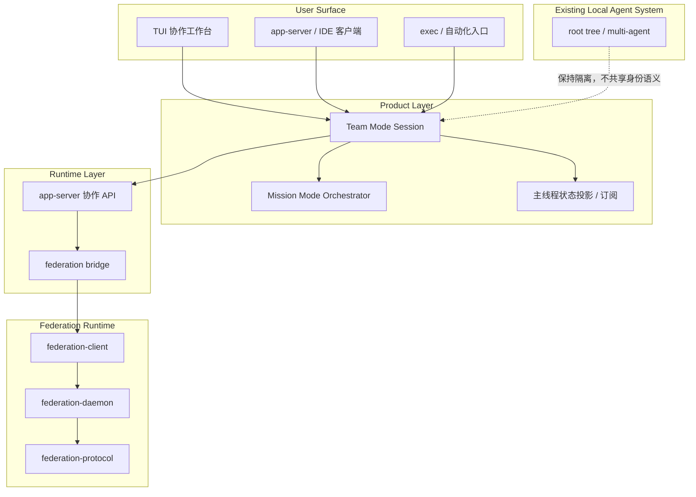
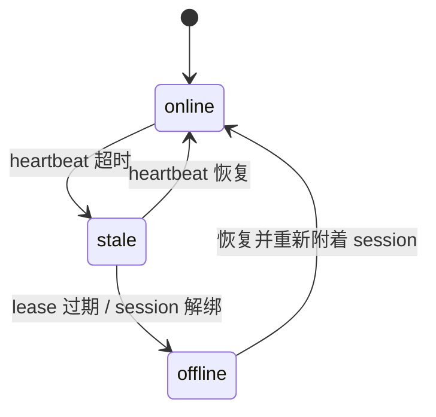
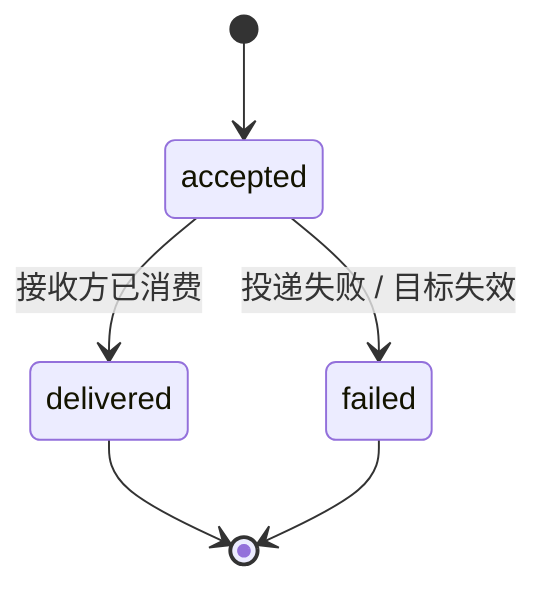
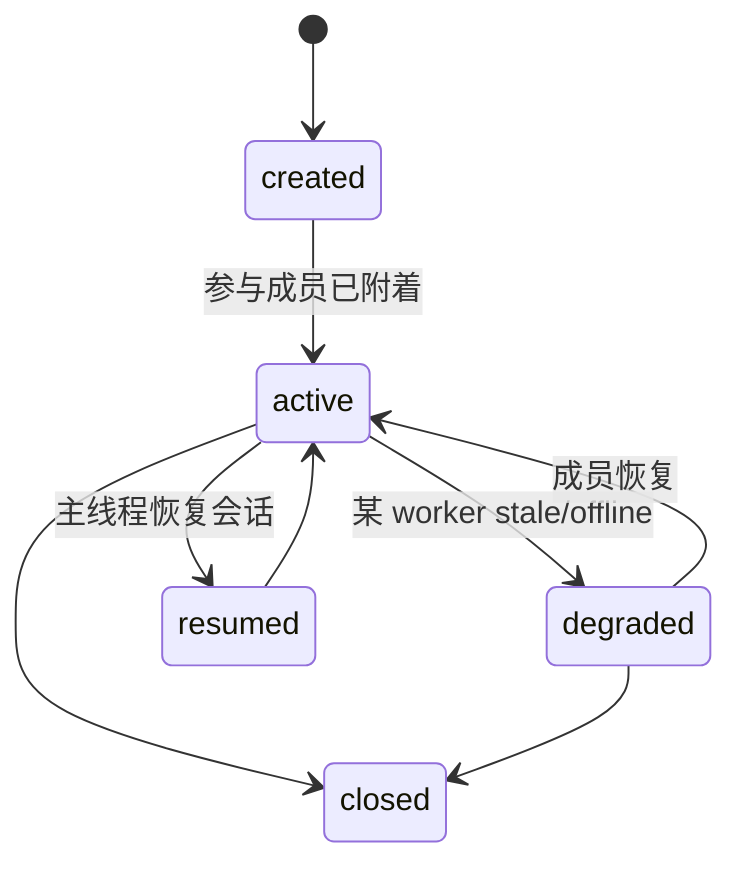

# 系统架构文档

## 文档信息
- **功能名称**：federation-team-mode
- **版本**：1.0
- **创建日期**：2026-04-23
- **作者**：Architect Agent

## 摘要

> 下游 Agent 请优先阅读本节，需要细节时再查阅完整文档。

- **架构模式**：在现有 federation runtime 之上新增 `Team Mode` 协作层，并为后续 `Mission Mode` 编排层预留扩展位。
- **技术栈**：继续复用 Rust workspace 内现有 `federation-protocol / federation-daemon / federation-client / app-server / tui / exec`，新增协作 session 协议与状态投影。
- **核心设计决策**：不复用 `/root` tree 语义；以 `sessionId + InstanceId + role` 作为协作域主键；以 app-server 为高层产品 API 入口；将 transport 与工作流分层。
- **主要风险**：真相源漂移、恢复语义不清、bridge 逻辑继续肥大、UI 与协议割裂。
- **项目结构**：保留 federation runtime 独立 crate，新增协作协议/状态/视图模块，不把 federated peer 塞进 `AgentPath`。

---
---

## 1. 架构概述

### 1.1 设计目标

本设计解决的是“跨独立 Codex 实例持续协作”而不是“再发几种 envelope”。因此架构目标是：

1. 让 federation 继续承担底层跨实例 transport/control plane。
2. 在其上方增加可产品化的 Team Mode 协作层。
3. 为 Mission Mode 的计划、里程碑、validator 预留扩展，不把 MVP 做成 PM 平台。
4. 明确与现有 root tree 多子代理模型的边界，避免语义污染。

### 1.2 分层架构图



### 1.3 关键架构决策

| 决策 | 选项 | 选择 | 原因 |
|------|------|------|------|
| 跨实例身份模型 | `AgentPath` / `InstanceId` | `InstanceId + sessionId + role` | `AgentPath` 只适用于 root tree 内部谱系 |
| 产品 API 入口 | 直接暴露 daemon / app-server 协作面 | app-server 协作面 | 终端用户不应感知 raw daemon 命令 |
| 工作流抽象 | 只做 Federation / Team + Mission 分层 | Team + Mission 分层 | 用户真实需求是协作与编排，不是 transport |
| 恢复语义 | 仅 fresh `thread/start` / session 恢复 | session 恢复 | 必须支持持续协作 |
| 结果展示 | daemon inbox / 主线程状态投影 | 主线程状态投影 | 提升主工作流可用性 |

---

## 2. 为什么不能复用现有 `/root` tree 语义

### 2.1 现有 root tree 的语义边界

当前多子代理系统建立在如下事实之上：

- `/root` 是单个 root session tree 的唯一路径根。
- `AgentPath` 表达的是树内路径，不是跨实例身份。
- `SessionSource::SubAgent` 编码的是本地父子线程谱系。
- `InterAgentCommunication` 是树内 mailbox，不是通用跨实例总线。

因此，若把 federated peer 映射成 `/root/frontend`、`/root/backend`：

- peer 的发现与失活会污染本地 thread tree 生命周期。
- resume、analytics、history 和 agent limit 会产生错义。
- 内部 envelope 更容易再次泄露到用户可见 assistant history。

### 2.2 约束结论

- federated peer 永远不作为 `/root/...` 子节点出现。
- Team Mode 的成员以 `InstanceId`、`threadId`、`role` 标识。
- 本地 subagent 与 federated peer 可以共存，但必须属于两个身份域。

---

## 3. 运行时分层

### 3.1 Federation Runtime

职责：

- 实例注册与发现
- 心跳与 lease
- 点对点 transport
- 本地持久化状态
- envelope / ack 基础协议

现有复用：

- `codex-rs/federation-protocol`
- `codex-rs/federation-daemon`
- `codex-rs/federation-client`

### 3.2 Team Mode

职责：

- 协作 session
- 参与成员 roster
- 任务/message/result 三类协作消息
- 共享任务板
- 主线程结果回流
- 在线状态与恢复

这是本次重构的主目标。

### 3.3 Mission Mode

职责：

- 计划与里程碑
- lead / validator / specialist 等高阶角色
- 任务再分解
- 审查与验收

在本轮只做概念与接口预留，不做 MVP 实现。

---

## 4. 领域模型

### 4.1 协作 Session

```json
{
  "sessionId": "sess-123",
  "ownerThreadId": "thread-main",
  "title": "frontend-backend collab",
  "mode": "team",
  "participants": [
    {
      "threadId": "thread-fe",
      "instanceId": "inst-fe",
      "role": "frontend",
      "displayName": "前端 Codex",
      "status": "online",
      "cwd": "/workspace/app-web",
      "lastHeartbeatAt": 1710000000,
      "lastMessageAt": 1710000001
    }
  ],
  "createdAt": 1710000000,
  "updatedAt": 1710000001
}
```

### 4.2 协作消息

```json
{
  "messageId": "msg-123",
  "sessionId": "sess-123",
  "senderThreadId": "thread-fe",
  "recipientThreadId": "thread-be",
  "messageType": "task | message | result",
  "text": "接口会多一个 status 字段，页面要不要展示？",
  "inReplyTo": null,
  "status": "accepted | delivered | failed",
  "createdAt": 1710000000
}
```

### 4.3 任务板项

```json
{
  "taskId": "task-001",
  "sessionId": "sess-123",
  "title": "补齐用户详情接口",
  "ownerRole": "backend",
  "status": "pending | in_progress | blocked | completed",
  "blockedBy": ["task-000"],
  "summary": "接口字段待与前端确认",
  "updatedAt": 1710000002
}
```

### 4.4 Mission 扩展位

```json
{
  "missionId": "mission-001",
  "sessionId": "sess-123",
  "milestones": [],
  "validators": [],
  "status": "planned | active | paused | completed"
}
```

---

## 5. API 轮廓

### 5.1 app-server 协作 RPC

| 方法 | 描述 | 说明 |
|------|------|------|
| `federation/session/create` | 创建协作 session | 高层工作流入口 |
| `federation/session/read` | 读取单个 session | 恢复与状态查看 |
| `federation/session/list` | 列出可见 session | 主工作台入口 |
| `federation/message/send` | 发送 task/message/result | 不暴露 raw envelope |
| `federation/message/list` | 拉取消息流 | 支持分页 |
| `federation/task/list` | 读取任务板 | MVP 基础任务板 |
| `federation/task/update` | 更新任务状态 | owner/status/blocked 更新 |

### 5.2 通知流

| 通知 | 触发时机 |
|------|----------|
| `federation/sessionUpdated` | participant 状态、标题或统计变化 |
| `federation/messageReceived` | 收到新的 task/message/result |
| `federation/messageStatusChanged` | accepted -> delivered/failed |
| `federation/taskUpdated` | 任务状态变化 |

### 5.3 daemon 侧策略

- daemon 可以继续使用 envelope 持久化，但其 ID 不应成为产品主词汇。
- app-server 负责把 daemon transport 投影成高层协作状态。
- 客户端看到的是 session/message/task，不是 ack 文件。

---

## 6. 模块边界

### 6.1 复用模块

| 模块 | 角色 |
|------|------|
| `federation-protocol` | transport 基础协议与 state layout |
| `federation-daemon` | runtime 状态与 IPC |
| `federation-client` | daemon 连接层 |
| `app-server` | 高层协作 API、状态投影、通知 |
| `tui` / `exec` | 用户入口与工作台表现层 |

### 6.2 新增或重构建议

| 建议位置 | 责任 |
|----------|------|
| `app-server-protocol` | 新增 session/message/task 高层 schema |
| `app-server` 新模块 | `collaboration_session`、`collaboration_state`、`collaboration_notifications` |
| `federation-protocol` | 若需要，可扩展 richer envelope，保持 transport 层中立 |
| `tui` 新模块 | Team/Mission 工作台视图、消息面板、任务板 |

### 6.3 不允许的耦合

- 不新增 `SessionSource::Federation` 去模拟 subagent 来源。
- 不让 `thread/read` 直接暴露底层 envelope JSON。
- 不让 UI 直接依赖 daemon 文件结构。

---

## 7. 状态机

### 7.1 Participant 状态机



### 7.2 Message 状态机



### 7.3 Session 生命周期



---

## 8. 恢复语义

恢复设计必须回答三个问题：

1. 谁是 session 真相源？
2. 重连时恢复哪些内容？
3. 过期成员如何清理？

推荐答案：

- 真相源：app-server 维护协作 session 状态投影，底层 transport 作为输入，不直接对外暴露。
- 恢复内容：
  - 参与成员 roster
  - 最近消息窗口
  - 最近任务板状态
  - participant 在线状态
- 清理策略：
  - stale 与 offline 不立刻删除历史
  - close session 时再清理活跃绑定

---

## 9. 目录结构建议

```
codex-rs/
├── app-server-protocol/
│   └── src/protocol/
│       └── v2.rs                     # 新增协作 session/message/task schema
├── app-server/
│   └── src/
│       ├── federation_bridge.rs      # 现有 runtime bridge，继续精简
│       ├── collaboration_session.rs  # 新增 session 生命周期与 API
│       ├── collaboration_state.rs    # 新增高层真相源/投影
│       ├── collaboration_events.rs   # 新增通知与 reducer
│       └── codex_message_processor.rs
├── federation-protocol/
│   └── src/
│       ├── envelope.rs
│       └── ...                       # 若必要扩展 richer transport payload
├── tui/
│   └── src/
│       ├── collaboration/
│       │   ├── workbench.rs
│       │   ├── task_board.rs
│       │   ├── message_stream.rs
│       │   └── worker_status.rs
│       └── ...
└── docs/
    └── team-mode.md
```

---

## 10. 风险与缓解

### 10.1 关键风险

| 风险 | 等级 | 影响范围 | 缓解措施 |
|------|------|----------|----------|
| transport 与高层 session 各有一份真相源 | 高 | 恢复、状态展示、通知 | 明确 app-server 投影为唯一对外真相 |
| 继续把复杂逻辑堆进 `federation_bridge.rs` | 高 | 维护成本、测试成本 | 新增协作模块，bridge 仅保留 runtime 接线 |
| UI 直接依赖底层 daemon 细节 | 中 | 产品可维护性 | 所有 UI 只消费 app-server 高层 contract |
| 任务板膨胀成全量项目管理系统 | 中 | 交付范围 | MVP 仅做 owner/status/blocked 基础字段 |

### 10.2 技术债务预警

- `federation_cmd.rs` 当前仍偏底层调试命令面，若未来保留，应重新定位为诊断/管理工具而非主产品入口。
- `TextTask/TextResult` 作为 runtime 兼容实现可暂时存在，但不能继续主导产品语义。

---

## 11. 验证策略

### 11.1 设计验证

- 逐项核对本设计是否仍与 `/root` tree 语义隔离。
- 检查 session/message/task 三类高层对象是否足以支撑用户主工作流。

### 11.2 协议验证

- app-server v2 schema round-trip 测试。
- 非法消息类型、丢失 `sessionId`、非法状态转移测试。

### 11.3 集成验证

- `thread/start` 进入 Team Mode。
- 主线程分派 task 给前端 worker。
- 前端 worker 给后端 worker 发中途 message。
- 后端 worker 发送 result 回主线程。
- `resume` 后恢复 roster 与最近消息。

### 11.4 回归验证

- 不影响现有 root tree 多子代理能力。
- `thread/read` / history 不出现内部协作 envelope 泄露。

---

## 12. 结论

本次重构的正确方向不是“让 federation 更像 subagent”，而是“让 federation runtime 成为 Team/Mission 协作模式的底座”。因此推荐：

- 保留 federation runtime 独立身份域
- 在 app-server 之上新增高层协作 session API
- 在 TUI/IDE 侧提供主线程协调工作台
- 为 Mission Mode 预留里程碑与 validator 扩展位

这样既满足你的真实场景，也不会把未发布 federation 的重构机会浪费在错误的兼容负担上。
