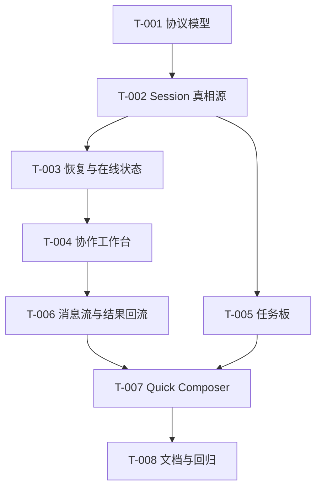

# 开发任务规格文档

## 文档信息
- **功能名称**：federation-team-mode
- **版本**：1.0
- **创建日期**：2026-04-23
- **作者**：Scrum Master Agent
- **关联故事**：`.agents/federation-team-mode/prd.md`

## 摘要

> 下游 Agent 请优先阅读本节，需要细节时再查阅完整文档。

- **任务总数**：8 个任务
- **前端任务**：3 个
- **后端任务**：5 个
- **关键路径**：`T-001 -> T-002 -> T-003 -> T-004 -> T-006`
- **预估复杂度**：高

---

## 1. 任务概览

### 1.1 统计信息
| 指标 | 数量 |
|------|------|
| 总任务数 | 8 |
| 创建文件 | 6 |
| 修改文件 | 9 |
| 测试用例 | 18 |

### 1.2 任务分布
| 复杂度 | 数量 |
|--------|------|
| 低 | 1 |
| 中 | 4 |
| 高 | 3 |

---

## 2. 任务详情

### Story: S-001 - 创建协作 session 并绑定前端/后端 worker

---

#### Task T-001：定义高层协作协议模型

**类型**：修改

**目标文件**：
| 文件路径 | 操作 | 说明 |
|----------|------|------|
| `codex-rs/app-server-protocol/src/protocol/v2.rs` | 修改 | 新增 session/message/task 高层 schema |
| `codex-rs/app-server-protocol/schema/json/v2/ThreadStartParams.json` | 修改 | 如协议生成涉及，更新输出 |
| `codex-rs/app-server-protocol/schema/json/ClientRequest.json` | 修改 | 同步 schema 产物 |

**实现步骤**：

1. 新增 `FederationCollabSession`、`FederationCollabParticipant`、`FederationCollabMessage`、`FederationCollabTask` 结构。
2. 定义 `messageType = task | message | result`、participant status、task status。
3. 为 app-server RPC 与通知定义 request/response/notification 类型。

**测试用例**：

文件：`codex-rs/app-server-protocol/src/protocol/v2.rs`

| 用例 ID | 描述 | 类型 |
|---------|------|------|
| TC-001-1 | session schema round-trip 正常 | 单元测试 |
| TC-001-2 | 非法 messageType 被拒绝 | 单元测试 |
| TC-001-3 | task status 序列化稳定 | 单元测试 |

**复杂度**：中

**依赖**：无

**注意事项**：
- 不要把 federated peer 绑定到 `AgentPath`。
- 不要让 transport 层字段直接泄露到产品 schema。

**完成标志**：
- [ ] 高层 schema 可编译
- [ ] round-trip 测试通过
- [ ] schema 产物更新完成

---

#### Task T-002：实现协作 session 真相源与 API 入口

**类型**：创建 / 修改

**目标文件**：
| 文件路径 | 操作 | 说明 |
|----------|------|------|
| `codex-rs/app-server/src/collaboration_session.rs` | 创建 | 协作 session 生命周期 |
| `codex-rs/app-server/src/collaboration_state.rs` | 创建 | 高层真相源与投影 |
| `codex-rs/app-server/src/codex_message_processor.rs` | 修改 | 接入高层 RPC 入口 |
| `codex-rs/app-server/src/lib.rs` | 修改 | 注册新模块 |

**实现步骤**：

1. 新增 session store / state projection 逻辑。
2. 提供 create/read/list/message/task 基础处理入口。
3. 约束所有高层读接口都从 app-server state 读取，不直连 daemon 文件。

**测试用例**：

文件：`codex-rs/app-server/tests/suite/v2/federation_collaboration.rs`

| 用例 ID | 描述 | 类型 |
|---------|------|------|
| TC-002-1 | 创建 session 成功并返回 roster | 集成测试 |
| TC-002-2 | 发送 message 后主线程能读到 | 集成测试 |
| TC-002-3 | list session 可分页 | 集成测试 |

**复杂度**：高

**依赖**：T-001

**注意事项**：
- 不要把 daemon 作为对外真相源。
- 模块命名必须聚焦职责，不要用杂项文件承载全部逻辑。

---

#### Task T-003：补齐恢复与在线状态语义

**类型**：创建 / 修改

**目标文件**：
| 文件路径 | 操作 | 说明 |
|----------|------|------|
| `codex-rs/app-server/src/collaboration_state.rs` | 修改 | participant 状态机与恢复逻辑 |
| `codex-rs/app-server/src/federation_bridge.rs` | 修改 | 只补接线所需状态上报，不扩产品逻辑 |
| `codex-rs/app-server/tests/suite/v2/federation_collaboration.rs` | 修改 | 增加恢复/离线测试 |

**实现步骤**：

1. 定义 `online / stale / offline` 计算规则。
2. 设计 session 恢复接口与最近消息窗口恢复逻辑。
3. 让 bridge 向高层状态投影上报心跳与投递结果。

**测试用例**：

| 用例 ID | 描述 | 类型 |
|---------|------|------|
| TC-003-1 | heartbeat 超时后进入 stale | 集成测试 |
| TC-003-2 | lease 失效进入 offline | 集成测试 |
| TC-003-3 | resume 后恢复 roster 与最近消息 | 集成测试 |

**复杂度**：高

**依赖**：T-002

**注意事项**：
- 不要把 session 恢复偷渡成新的 `thread/start`。
- 历史消息窗口要有限制，避免恢复时上下文爆炸。

---

### Story: S-002 - 主线程工作台可查看 worker、消息与结果

---

#### Task T-004：实现协作工作台基础视图

**类型**：创建 / 修改

**目标文件**：
| 文件路径 | 操作 | 说明 |
|----------|------|------|
| `codex-rs/tui/src/collaboration/workbench.rs` | 创建 | 主工作台容器 |
| `codex-rs/tui/src/collaboration/worker_status.rs` | 创建 | worker 状态卡 |
| `codex-rs/tui/src/collaboration/mod.rs` | 创建 | 模块出口 |
| `codex-rs/tui/src/lib.rs` | 修改 | 接入入口 |

**实现步骤**：

1. 构建 session header、worker 状态区、结果回流区的基础布局。
2. 绑定 participant status、最后活跃时间、当前任务摘要。
3. 在无 session、degraded、offline 等状态下提供清晰空态与错误态。

**测试用例**：

文件：`codex-rs/tui/tests/suite/collaboration_workbench.rs`

| 用例 ID | 描述 | 类型 |
|---------|------|------|
| TC-004-1 | 正常双 worker 布局 snapshot | Snapshot |
| TC-004-2 | 某 worker offline 状态 snapshot | Snapshot |
| TC-004-3 | 空 session 状态 snapshot | Snapshot |

**复杂度**：中

**依赖**：T-002, T-003

**注意事项**：
- 遵循 TUI snapshot 规范。
- 不要把 raw daemon/instance id 直接显示给用户。

---

#### Task T-005：实现共享任务板

**类型**：创建 / 修改

**目标文件**：
| 文件路径 | 操作 | 说明 |
|----------|------|------|
| `codex-rs/tui/src/collaboration/task_board.rs` | 创建 | 任务板视图 |
| `codex-rs/app-server/src/collaboration_session.rs` | 修改 | 提供 task list/update API |
| `codex-rs/tui/tests/suite/collaboration_task_board.rs` | 创建 | 任务板测试 |

**实现步骤**：

1. 设计 `pending / in_progress / blocked / completed` 四列任务板。
2. 实现 owner/status/summary/blockedBy 的基本显示。
3. 支持主线程调整状态与查看任务关联消息。

**测试用例**：

| 用例 ID | 描述 | 类型 |
|---------|------|------|
| TC-005-1 | 任务板列渲染正确 | Snapshot |
| TC-005-2 | blocked 任务高亮正确 | Snapshot |
| TC-005-3 | owner 变更后视图刷新 | 集成测试 |

**复杂度**：中

**依赖**：T-002, T-004

---

#### Task T-006：实现消息流与结果回流区

**类型**：创建 / 修改

**目标文件**：
| 文件路径 | 操作 | 说明 |
|----------|------|------|
| `codex-rs/tui/src/collaboration/message_stream.rs` | 创建 | task/message/result 时间线 |
| `codex-rs/tui/src/collaboration/result_panel.rs` | 创建 | 结果回流区 |
| `codex-rs/tui/tests/suite/collaboration_messages.rs` | 创建 | 消息流测试 |

**实现步骤**：

1. 统一渲染三类消息，但保证视觉区分。
2. result 默认进入主线程高亮区。
3. blocked 和待决策消息进入右侧优先面板。

**测试用例**：

| 用例 ID | 描述 | 类型 |
|---------|------|------|
| TC-006-1 | task/message/result 区分渲染 | Snapshot |
| TC-006-2 | result 回流到主线程区 | Snapshot |
| TC-006-3 | blocked 消息进入优先队列 | 集成测试 |

**复杂度**：中

**依赖**：T-004

**注意事项**：
- 不允许把中途 `message` 渲染成交付结果。
- 注意历史中过滤内部 envelope 泄露。

---

### Story: S-003 - worker 间中途通讯与恢复入口

---

#### Task T-007：实现 Quick Composer 与 worker 间通讯入口

**类型**：创建 / 修改

**目标文件**：
| 文件路径 | 操作 | 说明 |
|----------|------|------|
| `codex-rs/tui/src/collaboration/quick_composer.rs` | 创建 | 快速发送区 |
| `codex-rs/app-server/src/collaboration_session.rs` | 修改 | send message/task/result API |
| `codex-rs/tui/tests/suite/collaboration_composer.rs` | 创建 | 发送交互测试 |

**实现步骤**：

1. 提供 `发送消息 / 分派任务 / 记录结果` 三种发送模式。
2. 目标选择使用角色名而不是内部 ID。
3. 成功发送后更新消息流与任务板。

**测试用例**：

| 用例 ID | 描述 | 类型 |
|---------|------|------|
| TC-007-1 | 切换发送模式正确 | 单元测试 |
| TC-007-2 | 向 backend 发送 message 成功 | 集成测试 |
| TC-007-3 | 发送 result 后主线程收到回流 | 集成测试 |

**复杂度**：中

**依赖**：T-006

---

#### Task T-008：补全文档与回归

**类型**：创建 / 修改

**目标文件**：
| 文件路径 | 操作 | 说明 |
|----------|------|------|
| `docs/team-mode.md` | 创建 | 用户文档 |
| `.agents/llmdoc/index.md` | 修改 | 路由索引 |
| `.agents/llmdoc/memory/reflections/...` | 修改 | 记录实现反思 |

**实现步骤**：

1. 写用户文档，说明 Team Mode 与现有 multi-agent / federation 的差异。
2. 补“前端 worker + 后端 worker + 中途通讯”的端到端示例。
3. 汇总测试与残余风险。

**测试用例**：

| 用例 ID | 描述 | 类型 |
|---------|------|------|
| TC-008-1 | 文档示例命令与实际实现一致 | 手工验证 |
| TC-008-2 | llmdoc 索引可发现新文档 | 手工验证 |

**复杂度**：低

**依赖**：T-007

---

## 3. 实现前检查清单

- [ ] 已阅读 PRD、架构文档与本任务文档
- [ ] 已确认 federation 可直接重构，不要求兼容旧协议/命令
- [ ] 已确认任何跨实例身份都不进入 `/root` tree
- [ ] 已确认 app-server 为高层产品 API 入口
- [ ] 已准备 snapshot / 协议 round-trip / 集成测试环境

---

## 4. 任务依赖图

---

## 5. 文件变更汇总

### 5.1 新建文件
| 文件路径 | 关联任务 | 说明 |
|----------|----------|------|
| `codex-rs/app-server/src/collaboration_session.rs` | T-002 | 高层协作 session |
| `codex-rs/app-server/src/collaboration_state.rs` | T-002 | 对外真相源 |
| `codex-rs/tui/src/collaboration/workbench.rs` | T-004 | 主工作台 |
| `codex-rs/tui/src/collaboration/task_board.rs` | T-005 | 任务板 |
| `codex-rs/tui/src/collaboration/message_stream.rs` | T-006 | 消息流 |
| `docs/team-mode.md` | T-008 | 用户文档 |

### 5.2 修改文件
| 文件路径 | 关联任务 | 变更类型 |
|----------|----------|----------|
| `codex-rs/app-server-protocol/src/protocol/v2.rs` | T-001 | 新增 schema |
| `codex-rs/app-server/src/codex_message_processor.rs` | T-002 | 新增 RPC 接线 |
| `codex-rs/app-server/src/federation_bridge.rs` | T-003 | 状态上报与接线 |
| `codex-rs/tui/src/lib.rs` | T-004 | 入口接线 |

### 5.3 测试文件
| 文件路径 | 关联任务 | 测试类型 |
|----------|----------|----------|
| `codex-rs/app-server/tests/suite/v2/federation_collaboration.rs` | T-002/T-003 | 集成测试 |
| `codex-rs/tui/tests/suite/collaboration_workbench.rs` | T-004 | Snapshot |
| `codex-rs/tui/tests/suite/collaboration_task_board.rs` | T-005 | Snapshot |
| `codex-rs/tui/tests/suite/collaboration_messages.rs` | T-006 | Snapshot/集成 |

---

## 6. 代码规范提醒

### Rust / app-server
- 高层协作状态与 federation transport 分层。
- 避免继续膨胀中心文件，优先新模块。
- 新协议类型保持 app-server v2 命名与 camelCase 契约。

### TUI
- 对用户可见状态必须补 snapshot。
- 用结构化状态驱动视图，而不是直接解析底层 envelope。

### 测试
- 协议层优先 round-trip。
- app-server 层优先集成测试。
- TUI 层优先 snapshot + 关键交互测试。
