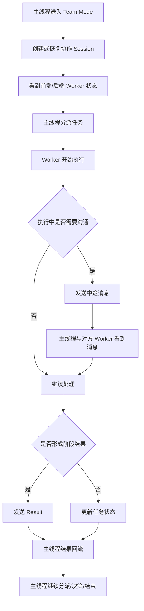
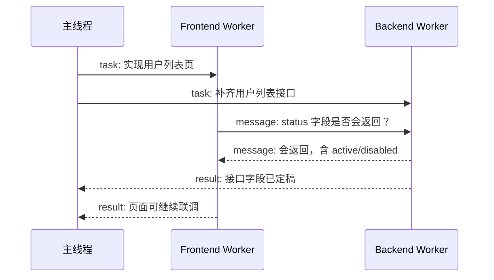

# UI/UX 规范文档

## 文档信息
- **功能名称**：federation-team-mode
- **版本**：1.0
- **创建日期**：2026-04-23
- **作者**：UI Designer Agent

## 摘要

> 下游 Agent 请优先阅读本节，需要细节时再查阅完整文档。

- **设计风格**：控制台式协作工作台，强调信息密度、清晰的状态层次、强可读性与低切换成本。
- **主色调**：以深石墨、中性灰、青蓝状态色和橙红警示色为主，避免营销化视觉，突出“工作现场”感。
- **核心组件**：协作 session 头部、worker 状态卡、消息流、共享任务板、结果回流面板、阻塞提示条、恢复入口。
- **响应式断点**：桌面优先；平板退化为双栏；移动端仅保留 session 概览与消息流。
- **设计系统**：沿用现有 TUI / app-server 客户端的简洁信息层级，不引入花哨视觉语言。

---
---

## 1. 设计概述

### 1.1 设计理念

这不是“聊天界面”，而是“主线程协调两个 worker 的作战室”。

设计原则：

- 主线程优先：用户首先关心谁在干活、谁卡住了、谁刚发了消息。
- 结果优先于装饰：结果、阻塞、待决策、在线状态必须一眼可见。
- 对话不是唯一中心：消息流、任务板、worker 状态卡应并列存在。
- 状态清晰：必须明确区分 `task`、`message`、`result`，避免把中途沟通误当成交付完成。
- 恢复友好：恢复协作 session 必须是产品入口的一部分，不是隐藏在技术命令后面。

### 1.2 设计原则
- **简洁**：一屏内只保留协调所需信息，避免把 daemon 细节和内部 ID 泄露到主视图。
- **一致**：前端 worker、后端 worker、主线程三者采用统一卡片结构与状态语义。
- **可访问**：颜色之外用图标、标签、文案同时表达状态。
- **响应式**：桌面支持三栏协作台，平板与窄屏优先保留消息流与任务板。

---

## 2. 用户流程

### 2.1 主流程



### 2.2 流程说明

| 步骤 | 页面/组件 | 用户行为 | 系统响应 |
|------|-----------|----------|----------|
| 1 | Session 入口 | 创建或恢复协作模式 | 展示 session 头部与成员卡 |
| 2 | Worker 状态区 | 查看前端/后端在线状态 | 显示 `online/stale/offline` 与最后活跃时间 |
| 3 | 任务板 | 分派或调整任务 | 更新 owner 与状态 |
| 4 | 消息流 | 查看中途 message/task/result | 高亮不同消息类型 |
| 5 | 结果回流区 | 接收阶段性交付 | 显示“需要决策/可继续/已完成” |
| 6 | 恢复入口 | 恢复上一次协作 | 还原成员、任务、最近消息 |

---

## 3. 设计令牌

### 3.1 颜色系统

#### 主色调
| 名称 | 色值 | 用途 |
|------|------|------|
| Primary | #1F6FEB | 主操作、选中状态 |
| Primary Light | #388BFD | 悬停态、轻强调 |
| Primary Dark | #1158C7 | 激活态 |

#### 语义色
| 名称 | 色值 | 用途 |
|------|------|------|
| Success | #2DA44E | `completed`、顺利交付 |
| Warning | #D29922 | `blocked`、待决策、stale |
| Error | #CF222E | 失败、离线、异常 |
| Info | #0969DA | 中途 message、提示 |
| Result | #8250DF | `result` 类型消息、阶段成果 |

#### 中性色
| 名称 | 色值 | 用途 |
|------|------|------|
| Gray 50 | #F6F8FA | 顶层背景 |
| Gray 100 | #EFF2F5 | 区块背景 |
| Gray 200 | #D8DEE4 | 分隔线 |
| Gray 400 | #8C959F | 次级信息 |
| Gray 700 | #424A53 | 正文 |
| Gray 900 | #1F2328 | 标题 |

### 3.2 排版系统

| 名称 | 大小 | 行高 | 字重 | 用途 |
|------|------|------|------|------|
| H1 | 28px | 1.2 | 700 | 协作 session 标题 |
| H2 | 22px | 1.3 | 600 | 栏目标题 |
| H3 | 18px | 1.4 | 600 | 卡片标题 |
| Body | 14px | 1.5 | 400 | 主要内容 |
| Small | 12px | 1.4 | 400 | 辅助信息 |
| Mono | 12px | 1.4 | 500 | 文件路径、状态码、ID 缩略展示 |

**字体族**：
- 英文：JetBrains Mono / Inter / system-ui
- 中文：PingFang SC / Microsoft YaHei

### 3.3 间距系统

基础单位：8px

| 名称 | 值 | 用途 |
|------|-----|------|
| spacing-1 | 4px | 标签内边距 |
| spacing-2 | 8px | 卡片内部紧凑间距 |
| spacing-3 | 12px | 常规组件间距 |
| spacing-4 | 16px | 栏目内部间距 |
| spacing-6 | 24px | 大区块分隔 |
| spacing-8 | 32px | 主布局边距 |

### 3.4 圆角

| 名称 | 值 | 用途 |
|------|-----|------|
| rounded-sm | 4px | 状态标签 |
| rounded-md | 8px | 卡片、按钮 |
| rounded-lg | 12px | 结果回流面板 |

### 3.5 阴影

| 名称 | 值 | 用途 |
|------|-----|------|
| shadow-sm | 0 1px 2px rgba(31,35,40,0.06) | 普通卡片 |
| shadow-md | 0 4px 12px rgba(31,35,40,0.08) | 重点面板 |

---

## 4. 页面规范

### 4.1 页面：Team Mode 协作工作台

#### 布局结构

桌面优先三栏：

```
+------------------------------------------------------------------------------------+
| Session Header: 标题 / 模式 / 恢复入口 / 新消息计数 / 全局状态                    |
+---------------------------+--------------------------------+-----------------------+
| 左栏：Worker 状态与任务板 | 中栏：消息流与线程回流         | 右栏：结果/阻塞/决策区 |
|                           |                                |                       |
| - Frontend Worker Card    | - task/message/result 时间线   | - 最新 Result 卡      |
| - Backend Worker Card     | - 输入区/快速发送              | - Blocked 列表         |
| - Shared Task Board       | - 筛选器                       | - 待处理决策           |
| - Session 概览            |                                | - 恢复/重试入口        |
+---------------------------+--------------------------------+-----------------------+
```

#### 响应式断点
| 断点 | 宽度 | 布局调整 |
|------|------|----------|
| 移动端 | < 768px | 仅保留 session 概览与消息流，任务板折叠为抽屉 |
| 平板 | 768-1199px | 双栏布局：左栏状态+任务，右栏消息+结果 |
| 桌面 | >= 1200px | 三栏完整布局 |

#### 组件清单
| 组件 | 位置 | 说明 |
|------|------|------|
| Session Header | 顶部 | 显示标题、模式、成员数、恢复入口 |
| Worker Status Card | 左栏顶部 | 展示角色、在线状态、最后活跃、当前任务 |
| Shared Task Board | 左栏中部 | 展示任务 owner/status/blocked |
| Message Stream | 中栏 | 统一展示 task/message/result |
| Quick Composer | 中栏底部 | 主线程快速发消息或分派任务 |
| Result Panel | 右栏顶部 | 展示最新结果与阶段成果 |
| Blocked Queue | 右栏中部 | 展示阻塞与待决策事项 |
| Recovery Panel | 右栏底部 | 展示恢复、重连、重新附着入口 |

---

## 5. 核心视图与组件规范

### 5.1 Session Header

内容：
- Session 标题
- 模式标签：`Team Mode` / `Mission Mode`
- 成员数量
- 未读消息计数
- “恢复上次协作”或“重新附着 worker”入口

状态：
| 状态 | 表现 |
|------|------|
| Normal | 标题 + 模式 + 成员状态摘要 |
| Attention | 有阻塞或待决策时顶部加 Warning 条 |
| Degraded | 有 worker `stale/offline` 时显示黄色或红色状态条 |

### 5.2 Worker Status Card

每个 worker 一张卡：

内容：
- 角色：`Frontend` / `Backend`
- 显示名
- 当前目录
- 在线状态
- 最后心跳时间
- 当前任务摘要
- 最近消息摘要

视觉规则：
- `online`：绿色点 + 正常文字
- `stale`：黄色点 + “等待恢复”
- `offline`：红色点 + “已离线”

关键操作：
- 发消息
- 指派任务
- 查看最近结果
- 重新附着/重试

### 5.3 Shared Task Board

列结构：

- `Pending`
- `In Progress`
- `Blocked`
- `Completed`

每张任务卡展示：
- 任务标题
- owner role
- 更新时间
- 一行摘要
- 是否依赖他人

交互：
- 主线程可拖拽或切换状态
- 点击任务卡可查看关联消息
- `Blocked` 任务自动在右栏阻塞区同步出现

### 5.4 Message Stream

消息类型必须视觉区分：

| 类型 | 标识 | 背景/边框 | 语义 |
|------|------|-----------|------|
| task | 方形任务标签 | 蓝边框 | 主线程或 worker 新分派任务 |
| message | 对话气泡 | 中性背景 | 中途沟通，不是交付 |
| result | 结果标签 | 紫色强调 | 阶段性交付，默认回流主线程 |

每条消息显示：
- 发送者 -> 接收者
- 时间
- 类型
- 正文
- 关联任务/回复链

绝不能显示：
- 原始 `instance_id`
- ack 文件路径
- daemon 内部 transport 细节

### 5.5 Quick Composer

模式切换：
- `发送消息`
- `分派任务`
- `记录结果`

字段：
- 目标角色
- 文本输入
- 可选关联任务

设计要求：
- 默认目标使用角色名，不要求用户输入内部 ID
- 发送前要明确当前是 `task / message / result`

### 5.6 Result Panel

此面板只显示高优先级结果：

- 最新 result
- 需要主线程确认的结果
- 可直接继续的结果

每条结果卡包括：
- 来源 worker
- 一句话成果摘要
- 下一步建议
- “转为新任务”按钮

### 5.7 Blocked Queue

显示所有需要主线程介入的事项：

- 被标记为 `blocked` 的任务
- 明确需要决策的消息
- worker 离线造成的等待事项

排序：
1. 红色异常
2. 黄色待决策
3. 普通阻塞

### 5.8 Recovery Panel

显示：
- 上次协作恢复入口
- 最近一次 session 时间
- 当前可恢复的 worker
- 重新附着状态

恢复成功后：
- 恢复 roster
- 恢复最近消息
- 恢复任务板状态

---

## 6. 双 worker 典型流程

### 6.1 场景：前端询问后端字段



### 6.2 主线程感知

主线程在同一工作台应看到：

- FE -> BE 的 message
- BE 的 result 回流
- 任务板中对应任务状态推进

---

## 7. 动效规范

### 7.1 过渡时长
| 名称 | 时长 | 用途 |
|------|------|------|
| fast | 120ms | 状态标签变化 |
| normal | 200ms | 面板切换、卡片展开 |
| slow | 300ms | session 恢复、关键结果高亮 |

### 7.2 动效原则
- 阻塞与结果的出现要有轻微高亮，帮助主线程快速注意。
- 在线状态变化只做克制闪动，不做炫技动画。
- 恢复成功可做一次“恢复完成”淡入提示。

---

## 8. 无障碍要求

### 8.1 状态表达
- 不能只靠颜色区分 `online/stale/offline`。
- 需要同时显示图标和文字标签。

### 8.2 键盘导航
- 消息流、任务板、worker 卡、恢复入口都可 Tab 导航。
- 快速发送框支持键盘切换目标角色与消息类型。

### 8.3 信息密度可控
- 提供紧凑/舒适两种密度。
- 提供仅看结果、仅看消息、仅看阻塞的筛选器。

---

## 9. 空状态与异常状态

### 9.1 尚未创建 session
- 显示“开始协作”入口
- 引导选择前端目录、后端目录、角色名称

### 9.2 某 worker 离线
- 该 worker 卡变红
- 相关未完成任务自动显示离线提示
- 恢复面板出现“重新附着 worker”

### 9.3 无新消息
- 消息流显示最近任务与推荐操作
- 不出现空白死界面

### 9.4 结果投递失败
- 右栏显示失败条
- 支持重试或转为普通消息

---

## 10. 设计结论

Team Mode 的主界面本质上是“协作工作台”，不是聊天窗。

因此设计上必须：

- 让任务板、消息流、结果回流并列
- 让主线程始终知道谁在做什么
- 让中途沟通与最终交付语义分开
- 把恢复入口与状态感知做成第一等能力

只要这四点成立，当前 federation 才会从“底层原语”真正变成“你会愿意每天使用的协作模式”。

---

## 变更记录

| 版本 | 日期 | 作者 | 变更内容 |
|------|------|------|----------|
| 1.0 | 2026-04-23 | UI Designer Agent | 初始版本 |
