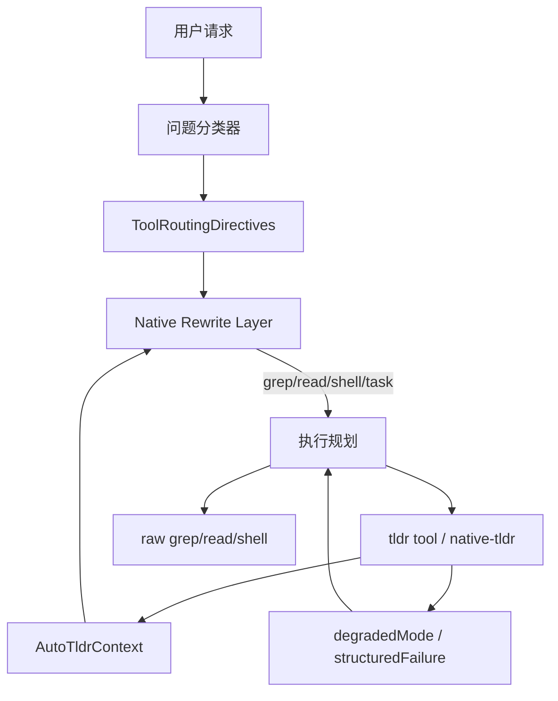
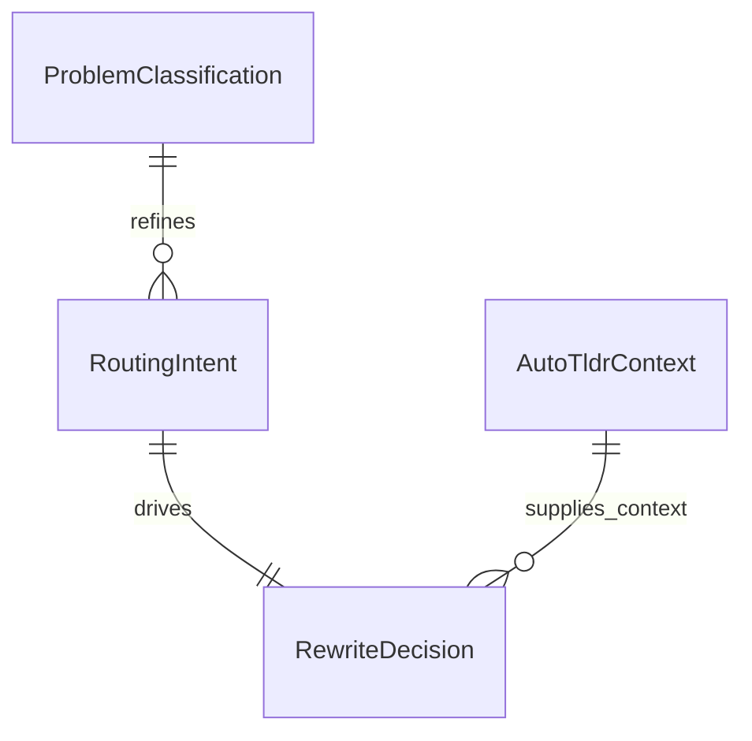

# 系统架构文档

## 文档信息
- **功能名称**：tldr-agent-first-optimization
- **版本**：2.0
- **创建日期**：2026-03-30
- **作者**：Architect Agent

## 摘要

> 下游 Agent 请优先阅读本节，需要细节时再查阅完整文档。

- **架构模式**：在 `codex-rs/core` 内实现统一的内嵌 `tldr-first` 决策与原生重写层，覆盖 prompt、router、handler、session state。
- **技术栈**：Rust / `codex-core` / `codex-native-tldr` / tool spec / rewrite engine / session context / docs。
- **核心设计决策**：共享统一问题分类模型；以内嵌重写替代外部 hook；把 `tldr` 结果作为结构化一等公民，而不是单纯文本注入。
- **主要风险**：shell 层识别误判、`read_file` 重写策略过激、结构分析与事实核对边界模糊。
- **项目结构**：除现有 `spec.rs` / `rewrite/` 外，最终版本需扩展到 `read_file`、shell 搜索、planner/subagent 上下文与 warm 策略。

---
---

## 1. 架构概述

### 1.1 总体架构图



### 1.2 核心设计原则

| 原则 | 说明 |
|------|------|
| `tldr-first` 而非 `tldr-only` | 结构化问题优先 `tldr`，事实核对仍回到源码 |
| 原生重写优于外接阻断 | 直接在运行时决定，不依赖外挂 hook 提示 |
| 统一分类优于局部 heuristics | grep/read/shell/task 使用同一套问题分类规则 |
| 显式逃生路径 | raw grep/read/regex/逐字阅读优先级明确且可测 |
| 结果可观测 | 降级和失败不隐藏，必须进入 payload 或日志 |

---

## 2. 分层设计

### 2.1 Prompt / Tool Description Layer
职责：
- 给 agent 明确的三类问题决策树：结构化、事实核对、混合问题。
- 规定默认起手式：
  - 结构化问题：先 `tldr`
  - 混合问题：先 `tldr`，再源码验真
  - 事实核对：直接源码/测试/文档

关键载体：
- `core/src/tools/spec.rs`
- `docs/tldr-agent-first-guidance/tool-description.md`
- 后续若有系统级提示词，也应复用同一套规则文案

### 2.2 Classification Layer
职责：
- 解析用户文本、当前任务上下文和最近成功 `tldr` 状态。
- 判断当前属于：
  - `structural`
  - `factual`
  - `mixed`
- 同时提取正向/负向控制指令：
  - `force_tldr`
  - `disable_auto_tldr_once`
  - `force_raw_grep`
  - `force_raw_read`

建议位置：
- 现有 `ToolRoutingDirectives`
- 后续可扩展为更强的 `ProblemClassification` 或 `RoutingIntent`

### 2.3 Native Rewrite Layer
职责：
- 在真正执行工具前做内嵌重写，而不是等外部系统拦截。
- 这是最终版本最关键的差异化层。

目标覆盖入口：
1. `grep_files`
2. `read_file`
3. shell 搜索类命令（如 `rg`, `grep`, `find + xargs rg` 的常见形态）
4. planning / subagent task 启动前的上下文准备

### 2.4 TLDR Execution Layer
职责：
- 统一走 `codex-native-tldr` 的 daemon-first 调用。
- 根据 action 特性区分：
  - 可本地回退：`context` / `impact` / `semantic` / `diagnostics` 等
  - daemon-only：`status` / `warm` / `notify` / `snapshot` 等

### 2.5 State / Memory Layer
职责：
- 用 `AutoTldrContext` 持久化最近一次成功分析的：
  - project root
  - language
  - symbol
  - query
  - paths
- 后续扩展：
  - last_action
  - last_problem_kind
  - last_degraded_mode
  - confidence / freshness

### 2.6 Observability Layer
职责：
- 把以下信息显式暴露给 agent：
  - `reason`
  - `structuredFailure`
  - `degradedMode`
  - 来源是 daemon 还是 local fallback
- 必须能帮助 agent 决定：继续、回退、重试、还是提示用户。

---

## 3. 目录与模块演进

### 3.1 当前基础模块

```
codex-rs/core/src/tools/
├── spec.rs
├── rewrite/
│   ├── directives.rs
│   ├── auto_tldr.rs
│   ├── engine.rs
│   └── context.rs
└── handlers/
    └── tldr.rs
```

### 3.2 最终版本建议扩展

```
codex-rs/core/src/tools/
├── rewrite/
│   ├── directives.rs
│   ├── classification.rs         # 新增：问题分类与意图归一
│   ├── auto_tldr.rs              # grep_files / read_file / shell / planner rewrite
│   ├── shell_search_rewrite.rs   # 可选：命令形态识别
│   ├── read_gate.rs              # 可选：读文件前结构化前置层
│   └── context.rs
└── planning/
    └── tldr_strategy.rs          # 可选：mixed-question 规划模板
```

---

## 4. 关键运行时对象

### 4.1 问题分类模型



建议结构：

| 字段 | 说明 |
|------|------|
| problem_kind | `structural` / `factual` / `mixed` |
| force_tldr | 用户显式要求先用 `tldr` |
| disable_auto_tldr_once | 用户显式要求不要 `tldr` |
| force_raw_grep | 用户显式要求 regex/raw grep |
| force_raw_read | 用户显式要求原文/逐字阅读 |
| prefer_context_search | 更偏 symbol/context 还是 semantic |

### 4.2 `AutoTldrContext`

| 字段 | 当前 | 最终建议 |
|------|------|----------|
| last_project_root | 有 | 保留 |
| last_language | 有 | 保留 |
| last_query | 有 | 保留 |
| last_symbol | 有 | 保留 |
| last_paths | 有 | 保留 |
| last_action | 无 | 建议增加 |
| last_problem_kind | 无 | 建议增加 |
| last_degraded_mode | 无 | 建议增加 |

---

## 5. 入口级重写设计

### 5.1 `grep_files`
最终策略：
- regex/raw grep => passthrough
- symbol/context 类 => `tldr context`
- 语义搜索类 => `tldr semantic`
- 混合问题 => 先 `tldr` 建结构，再允许精确 grep 验证
- 显式 `force_tldr` 时 safe 模式可复用最近语言

### 5.2 `read_file`
最终策略不应只有“直接读”或“完全禁止读”两种。
建议三段式：

1. 结构化问题：先返回/注入 `tldr context` 或 `structure` 摘要
2. 若仍需精确内容：再允许局部 raw read
3. 用户显式要求原文/逐字时：直接 raw read

### 5.3 shell 搜索命令
建议像 RTK 一样做命令形态识别，但因为我们是内嵌，可以更进一步：

- 识别典型 broad search 形态：
  - `rg foo`
  - `grep -R foo`
  - `find ... | xargs rg ...`
- 若问题属于结构化或混合类：
  - 先 soft warning
  - 条件满足时直接改写到 `tldr`
- 若明确 raw/regex：不改写

### 5.4 planning / subagent
- 在 spawn/subtask 前，根据问题分类自动注入：
  - 推荐 action
  - 最近 `tldr` 上下文
  - 降级状态说明
- 避免每个子 agent 自己重新用广泛 grep 起手

---

## 6. 降级与失败语义

### 6.1 成功类型
| 类型 | 含义 | agent 应如何理解 |
|------|------|------------------|
| daemon success | daemon 正常返回 | 正常成功 |
| local fallback | daemon 不可用，落到本地引擎 | 降级成功，不等于 daemon 正常 |
| diagnostic only | 只能拿到诊断状态 | 不可当作结构分析成功 |

### 6.2 统一 contract
必须稳定使用：
- `structuredFailure`
- `degradedMode`
- `reason`
- source 是 `daemon` 还是 `local`

agent 规则：
- 有 `structuredFailure`：先判断能否重试
- 有 `degradedMode.local_fallback`：允许继续，但要声明降级
- 有 `degradedMode.diagnostic_only`：只能报告状态，不要假设分析完成

---

## 7. Warm / Preload 设计

### 7.1 策略选择
可选两种：

1. Session-start warm
- 优点：首个 `tldr` 延迟最低
- 缺点：会话一开始就有额外成本

2. First-structural-query warm
- 优点：更惰性
- 缺点：首个结构化问题仍有冷启动成本

建议最终策略：
- 默认惰性 warm
- 对高置信结构化问题，在第一次命中时自动 warm
- 后续可按配置切换为 session-start warm

---

## 8. 分阶段落地但避免重构

### 阶段 P1：规则与局部改写
- tool description
- agent-first 指南
- `force_tldr`
- `grep_files` 更智能 rewrite

### 阶段 P2：统一分类模型
- 提取 `ProblemClassification`
- 让 `grep_files` / `read_file` / planning 共用一套分类器

### 阶段 P3：原生拦截扩展
- `read_file` 前置 `tldr`
- shell 搜索 soft/conditional rewrite
- subagent/context injection

### 阶段 P4：运行时优化
- warm / preload
- 更强 observability
- 更丰富 `AutoTldrContext`

注意：
- 这四个阶段是实施顺序，不是四套不同架构。
- 每阶段都必须往同一个终局架构收敛。

---

## 9. 变更记录

| 版本 | 日期 | 作者 | 变更内容 |
|------|------|------|----------|
| 2.0 | 2026-03-30 | Architect Agent | 升级为最终版内嵌 tldr 架构 |
| 1.0 | 2026-03-30 | Architect Agent | 初始 MVP 架构 |
