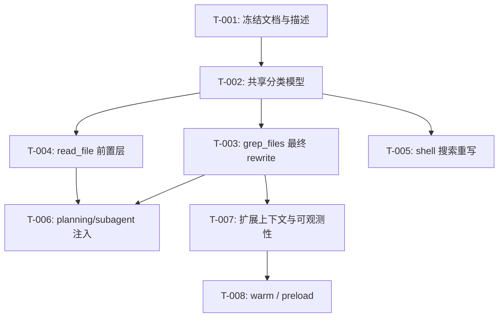

# 开发任务规格文档

## 文档信息
- **功能名称**：tldr-agent-first-optimization
- **版本**：2.0
- **创建日期**：2026-03-30
- **作者**：Scrum Master Agent
- **关联故事**：`.agents/tldr-agent-first-optimization/prd.md`

## 摘要

> 下游 Agent 请优先阅读本节，需要细节时再查阅完整文档。

- **任务总数**：8 个任务
- **前端任务**：0 个
- **后端任务**：8 个（均为 core/docs/runtime 路由改动）
- **关键路径**：先统一规则与分类，再扩展 `grep_files`，然后做 `read_file`、shell 搜索和 planning 注入。
- **预估复杂度**：高

---
---

## 1. 任务概览

### 1.1 统计信息
| 指标 | 数量 |
|------|------|
| 总任务数 | 8 |
| 创建文件 | 3 |
| 修改文件 | 6+ |
| 测试用例 | 8+ |

### 1.2 任务分布
| 复杂度 | 数量 |
|--------|------|
| 低 | 2 |
| 中 | 4 |
| 高 | 2 |

---

## 2. 任务详情

### Story: S-001 - 统一 `tldr-first` 规则与分类模型

---

#### Task T-001：冻结最终版文档与工具描述

**类型**：修改

**目标文件**：
| 文件路径 | 操作 | 说明 |
|----------|------|------|
| `codex-rs/core/src/tools/spec.rs` | 修改 | 更新 `tldr` tool description 为最终规则 |
| `docs/tldr-agent-first-guidance/tool-description.md` | 修改 | 更新 agent-first 指南 |
| `.agents/tldr-agent-first-optimization/*.md` | 修改 | 保持最终版设计文档一致 |

**实现步骤**：
1. 明确三类问题：结构化 / 事实核对 / 混合。
2. 明确起手式：结构化先 `tldr`，混合先 `tldr` 后验真，事实核对直接源码/测试。
3. 明确 raw/regex 逃生路径。

**测试用例**：文档一致性检查

**复杂度**：低

**依赖**：无

---

#### Task T-002：抽共享分类模型

**类型**：创建 + 修改

**目标文件**：
| 文件路径 | 操作 | 说明 |
|----------|------|------|
| `codex-rs/core/src/tools/rewrite/classification.rs` | 创建 | 统一问题分类与意图归一 |
| `codex-rs/core/src/tools/rewrite/directives.rs` | 修改 | 从简单字符串匹配提升到共享分类入口 |
| `codex-rs/core/src/tools/rewrite/mod.rs` | 修改 | 暴露分类模块 |

**实现步骤**：
1. 定义问题类型枚举：`structural` / `factual` / `mixed`。
2. 定义统一 routing intent，覆盖：`force_tldr`、`disable_auto_tldr_once`、`force_raw_grep`、`force_raw_read`、`prefer_context_search`。
3. 让现有 directives 逻辑复用该分类层，而不是散落 heuristic。

**测试用例**：
| 用例 ID | 描述 | 类型 |
|---------|------|------|
| TC-002-1 | 结构化问题被识别为 `structural` | 单元测试 |
| TC-002-2 | 默认值/feature 问题被识别为 `factual` | 单元测试 |
| TC-002-3 | 混合问题被识别为 `mixed` | 单元测试 |

**复杂度**：中

**依赖**：T-001

---

### Story: S-002 - 完成 `grep_files` 最终行为

---

#### Task T-003：实现 `grep_files` 最终版 rewrite

**类型**：修改

**目标文件**：
| 文件路径 | 操作 | 说明 |
|----------|------|------|
| `codex-rs/core/src/tools/rewrite/auto_tldr.rs` | 修改 | 接入共享分类模型与最终版决策 |
| `codex-rs/core/src/tools/rewrite/engine.rs` | 修改 | 统一 route decision 入口 |

**实现步骤**：
1. `regex/raw grep` 继续 passthrough。
2. `structural` 优先改写为 `tldr context/impact`。
3. `mixed` 先走轻量 `tldr`，保留后续精确 grep 核对空间。
4. `force_tldr` 时 safe 模式可复用最近语言。

**测试用例**：
| 用例 ID | 描述 | 类型 |
|---------|------|------|
| TC-003-1 | regex grep 保持原路径 | 单元测试 |
| TC-003-2 | symbol 搜索走 `tldr context` | 异步单元测试 |
| TC-003-3 | 显式 `force_tldr` 时 safe 模式复用最近语言 | 异步单元测试 |
| TC-003-4 | mixed 问题走 `tldr-first` 再保留核对能力 | 异步单元测试 |

**复杂度**：中

**依赖**：T-002

---

### Story: S-003 - 把 `read_file` 纳入最终版设计

---

#### Task T-004：新增 `read_file` 前置结构摘要层

**类型**：创建 + 修改

**目标文件**：
| 文件路径 | 操作 | 说明 |
|----------|------|------|
| `codex-rs/core/src/tools/rewrite/read_gate.rs` | 创建 | 读文件前的结构化决策层 |
| `codex-rs/core/src/tools/rewrite/engine.rs` | 修改 | 让 `read_file` 可进入前置策略 |
| 相关 read handler 文件 | 修改 | 按需接入 |

**实现步骤**：
1. 若问题是 `structural`，优先提供 `tldr context/structure` 摘要。
2. 若问题是 `mixed`，先摘要后允许精确 raw read。
3. 若用户显式要求原文/逐字，直接 raw read。

**测试用例**：
| 用例 ID | 描述 | 类型 |
|---------|------|------|
| TC-004-1 | 结构化问题读文件前先触发 `tldr` 摘要 | 行为测试 |
| TC-004-2 | `force_raw_read` 跳过前置 `tldr` | 行为测试 |
| TC-004-3 | mixed 问题允许摘要后继续精确读取 | 行为测试 |

**复杂度**：高

**依赖**：T-002

---

### Story: S-004 - 纳入 shell 搜索与 planning

---

#### Task T-005：实现 shell 搜索命令识别与重写

**类型**：创建 + 修改

**目标文件**：
| 文件路径 | 操作 | 说明 |
|----------|------|------|
| `codex-rs/core/src/tools/rewrite/shell_search_rewrite.rs` | 创建 | shell broad search 识别与路由 |
| shell/unified exec 相关 handler | 修改 | 接入 soft warning 或 direct rewrite |

**实现步骤**：
1. 识别常见 broad search 形态：`rg`、`grep -R`、`find | xargs rg`。
2. 若问题属 `structural/mixed`，优先给 soft warning，再逐步升级到 direct rewrite。
3. 若显式 raw/regex，则不改写。

**测试用例**：
| 用例 ID | 描述 | 类型 |
|---------|------|------|
| TC-005-1 | broad `rg` 被识别为搜索型命令 | 单元测试 |
| TC-005-2 | 结构化问题下 shell 搜索得到 `tldr-first` 提示或重写 | 行为测试 |
| TC-005-3 | regex/raw 搜索不改写 | 行为测试 |

**复杂度**：高

**依赖**：T-002

---

#### Task T-006：为 planning / subagent 注入 `tldr-first` 上下文

**类型**：修改

**目标文件**：
| 文件路径 | 操作 | 说明 |
|----------|------|------|
| planning / spawn / subagent 相关模块 | 修改 | 在任务启动前注入推荐 action 与上下文 |

**实现步骤**：
1. 根据问题分类提供推荐 action。
2. 注入最近成功 `tldr` 上下文与降级状态。
3. 避免子 agent 从 broad grep 起手。

**测试用例**：
| 用例 ID | 描述 | 类型 |
|---------|------|------|
| TC-006-1 | structural 子任务收到 `tldr-first` 指引 | 行为测试 |
| TC-006-2 | degradedMode 被正确传递到子任务上下文 | 行为测试 |

**复杂度**：中

**依赖**：T-003, T-004

---

### Story: S-005 - 上下文、可观测性与 warm

---

#### Task T-007：扩展 `AutoTldrContext` 与可观测性

**类型**：修改

**目标文件**：
| 文件路径 | 操作 | 说明 |
|----------|------|------|
| `codex-rs/core/src/tools/rewrite/context.rs` | 修改 | 增加 action/problem_kind/degraded info |
| `codex-rs/core/src/tools/handlers/tldr.rs` | 修改 | 记录更多成功与降级信息 |
| 日志/trace 相关文件 | 修改 | 补 route reason 与 decision logging |

**实现步骤**：
1. 增加 `last_action`、`last_problem_kind`、`last_degraded_mode`。
2. 成功调用时记录；降级调用时也更新可观测信息。
3. 对 rewrite/no-rewrite 输出更明确的 reason。

**测试用例**：
| 用例 ID | 描述 | 类型 |
|---------|------|------|
| TC-007-1 | 成功 `tldr` 后上下文记录完整 | 单元测试 |
| TC-007-2 | 降级模式能被记录和读取 | 单元测试 |

**复杂度**：中

**依赖**：T-003

---

#### Task T-008：实现 warm / preload 策略

**类型**：修改

**目标文件**：
| 文件路径 | 操作 | 说明 |
|----------|------|------|
| session/startup 相关模块 | 修改 | 增加惰性 warm 或 session-start warm |
| `tldr` 调用入口 | 修改 | 首个结构化问题可触发 warm |

**实现步骤**：
1. 默认采用 first-structural-query warm。
2. 预留配置开关切换为 session-start warm。
3. 记录 warm 状态，避免重复无意义触发。

**测试用例**：
| 用例 ID | 描述 | 类型 |
|---------|------|------|
| TC-008-1 | 首个结构化问题触发 warm | 行为测试 |
| TC-008-2 | 非代码问题不触发 warm | 行为测试 |

**复杂度**：中

**依赖**：T-007

---

## 3. 实现前检查清单

在开始实现前，确保：

- [ ] 已阅读 PRD、架构和 tech-review 文档
- [ ] 已确认这是最终版架构，不再按保守 MVP 收窄范围
- [ ] 已确认工作区有其他未完成改动，避免误覆盖
- [ ] 已按阶段规划好可独立验证的提交边界

---

## 4. 任务依赖图

---

## 5. 文件变更汇总

### 5.1 新建文件
| 文件路径 | 关联任务 | 说明 |
|----------|----------|------|
| `codex-rs/core/src/tools/rewrite/classification.rs` | T-002 | 共享分类层 |
| `codex-rs/core/src/tools/rewrite/read_gate.rs` | T-004 | 读文件前置层 |
| `codex-rs/core/src/tools/rewrite/shell_search_rewrite.rs` | T-005 | shell 搜索识别与重写 |

### 5.2 修改文件
| 文件路径 | 关联任务 | 变更类型 |
|----------|----------|----------|
| `codex-rs/core/src/tools/spec.rs` | T-001 | 修改描述 |
| `docs/tldr-agent-first-guidance/tool-description.md` | T-001 | 修改文档 |
| `codex-rs/core/src/tools/rewrite/directives.rs` | T-002 | 升级意图提取 |
| `codex-rs/core/src/tools/rewrite/auto_tldr.rs` | T-003 | 最终 rewrite 逻辑 |
| `codex-rs/core/src/tools/rewrite/engine.rs` | T-003/T-004 | 多入口路由 |
| `codex-rs/core/src/tools/rewrite/context.rs` | T-007 | 扩展上下文 |
| `codex-rs/core/src/tools/handlers/tldr.rs` | T-007/T-008 | 记录与 warm 相关逻辑 |

### 5.3 测试文件
| 文件路径 | 关联任务 | 测试类型 |
|----------|----------|----------|
| `classification.rs` 对应测试 | T-002 | 单元测试 |
| `auto_tldr.rs` 对应测试 | T-003 | 异步单元测试 |
| `read_gate.rs` 对应测试 | T-004 | 行为测试 |
| `shell_search_rewrite.rs` 对应测试 | T-005 | 单元/行为测试 |
| `context.rs` 对应测试 | T-007 | 单元测试 |

---

## 6. 代码规范提醒

### Rust
- 统一从共享分类层产出 routing intent，避免多处重复 heuristic
- rewrite 逻辑使用 guard clause，保持扁平
- 不新增隐藏 fallback；所有回退必须通过字段或 reason 可观测

### 测试
- 按入口分类测试：grep/read/shell/planning/context/warm
- 优先验证优先级和行为边界
- 使用描述性测试名，覆盖 raw escape 与 degraded path

### 文档
- 实现和文档必须同步；任何阶段落地都要对照最终架构章节
- 明确区分“结构分析结论”和“源码事实结论”

---

## 变更记录

| 版本 | 日期 | 作者 | 变更内容 |
|------|------|------|----------|
| 2.0 | 2026-03-30 | Scrum Master Agent | 升级为最终版任务规划 |
| 1.0 | 2026-03-30 | Scrum Master Agent | 初始 MVP 任务规划 |
