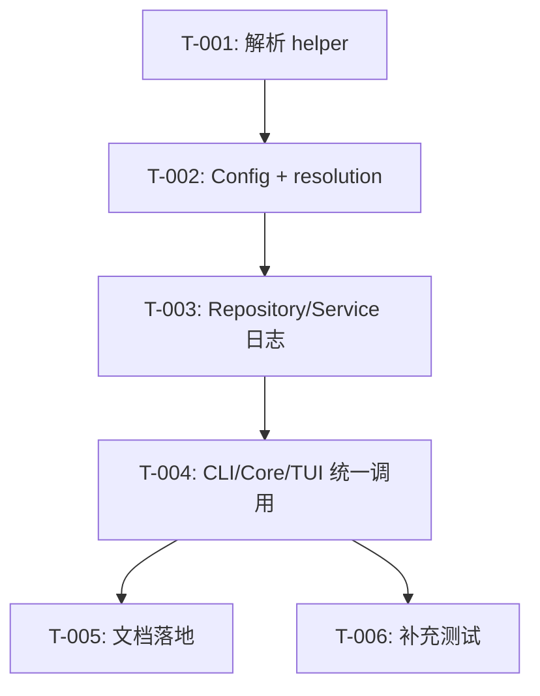

# 开发任务规格文档

## 文档信息
- **功能名称**：zmemory-path-design
- **版本**：1.0
- **创建日期**：2026-03-30
- **作者**：Scrum Master Agent
- **关联故事**：`.agents/zmemory-path-design/prd.md`

## 摘要

> 下游 Agent 请优先阅读本节，需要细节时再查阅完整文档。

- **任务总数**：6
- **前端任务**：0
- **后端任务**：6
- **关键路径**：T-004 CLI/core/TUI 统一调用 + `doctor/stats` 输出路径可观测
- **预估复杂度**：中偏高

---

## 1. 任务概览

### 1.1 统计信息
| 指标 | 数量 |
|------|------|
| 总任务数 | 6 |
| 创建文件 | 1 |
| 修改文件 | 10 |
| 测试用例 | 5 |

### 1.2 任务分布
| 复杂度 | 数量 |
|--------|------|
| 低 | 1 |
| 中 | 4 |
| 高 | 1 |

### 1.3 测试矩阵
| 覆盖层 | 说明 | 推荐命令 |
|---------|------|----------|
| helper + 核心解析 | 验证 `resolve_zmemory_path` 的主仓库根 / `cwd` 和 override 分支 | `cargo test -p codex-zmemory path_resolution::tests` |
| zmemory 配置 + repository | 确保 `ZmemoryConfig`/`ZmemoryRepository` 使用解析结果并 expose reason | `cargo test -p codex-zmemory config::tests repository::tests service::doctor_output` |
| CLI 诊断输出 | `doctor/stats` 报告 JSON 中带 `pathResolution` 与 `reason` | `cargo test -p codex-cli --test zmemory` |
| 核心工具 + handler | `codex-core` zmemory handler 读 `pathResolution`，model tool output 包含 reason | `cargo test -p codex-core tools::handlers::zmemory` |
| 集成验收 | 现有 e2e 确认 doctor/stats 新字段 | `cargo test -p codex-core suite::zmemory_e2e` |
| 配置层 | 新 `[zmemory].path` 字段在 config loader/schema 中可读、可写、可校验 | `cargo test -p codex-core config::tests && just write-config-schema` |

---

## 2. 任务详情

### Story: S-001 - [zmemory].path 单值隔离与可观测

---

#### Task T-001：在 codex-zmemory 内构建统一的 [zmemory].path 解析 helper

**类型**：创建

**目标文件**：
| 文件路径 | 操作 | 说明 |
|----------|------|------|
| `codex-rs/zmemory/src/path_resolution.rs` | 创建 | 新增 helper、数据结构与 hash 算法 |
| `codex-rs/zmemory/src/lib.rs` | 修改 | 暴露模块给 CLI/core 等调用 |
| `codex-rs/zmemory/Cargo.toml` | 修改 | 新增对 `codex-git-utils` 的依赖 |

**实现步骤**：
1. **设计解析链**：接收 `codex_home` 路径、`turn.cwd`、可选 `[zmemory].path` 字符串，返回 `ZmemoryPathResolution { db_path, workspace_key, source, canonical_base, reason }`；其中 `workspace_key` 语义上表示稳定项目 key。
   ```rust
   pub fn resolve_zmemory_path(
       codex_home: &Path,
       cwd: &Path,
       explicit_path: Option<&str>,
   ) -> Result<ZmemoryPathResolution> { ... }
   ```
   - `source` 区分 `Explicit`, `RepoRoot`, `Cwd`，`reason` 记录原始输入与选定 anchor。
2. **默认隔离策略**：使用现有主仓库根识别优先取主仓库根，否则 fallback `cwd`，canonicalize 后直接 `sha256`（取前 12 hex）生成 `workspace_key`，再拼接 `$CODEX_HOME/zmemory/projects/<project-key>/zmemory.db`。
3. **错误处理**：base 路径 `canonicalize` 失败时直接返回错误，不静默回退到旧全局路径。

**测试用例**：
| 用例 ID | 描述 | 类型 |
|---------|------|------|
| TC-001-1 | `canonicalize` 后的主仓库根 hash 同一仓库稳定 | 单元测试 |
| TC-001-2 | 相对路径在 git 仓库下相对于主仓库根操作 | 单元测试 |
| TC-001-3 | 非 git 目录 fallback `cwd` 并输出 `reason` | 单元测试 |
| TC-001-4 | 同一主仓库下的 worktree 共享同一个默认 `workspace_key`（稳定项目 key） | 单元测试 |

**复杂度**：中

**依赖**：无

**注意事项**：
- hash 输入只基于 canonical 后的原始路径，不额外 lowercase/casefold；helper 函数不应重复进行 `canonicalize`。
- helper 必须留在 `codex_zmemory`，供 CLI/core/tool API 共用，避免循环依赖。

**完成标志**：
- [ ] helper 模块编写完成并通过 `cargo test -p codex-zmemory path_resolution::tests`
- [ ] `reason`/`source` 字段能描述 `repo_root`/`cwd`/`explicit` 三种情况
- [ ] `workspace_key` 取 `sha256` 前 12 个 hex，不包含 `/` 等字符，并稳定表示同一项目身份

---

#### Task T-002：扩展 ZmemoryConfig，暴露解析结果

**类型**：修改

**目标文件**：
| 文件路径 | 操作 | 说明 |
|----------|------|------|
| `codex-rs/zmemory/src/config.rs` | 修改 | 存储 `ZmemoryPathResolution`、新增 getter |

**实现步骤**：
1. **重构构造器**：引入 `ZmemoryPathResolution`，提供 `new_with_resolution` 和 `new_with_settings`；`new_with_settings` 只接受外部已解析好的 resolution，不在 config 内部默认调用 helper。
2. **暴露 reason**：提供 `pub fn path_resolution(&self) -> &ZmemoryPathResolution`，`db_path()` 直接引用 resolution，保留 `zmemory_db_path` 作为 fallback helper 用于不触发 helper 的选项。
3. **追踪旧行为**：旧全局路径只作为显式配置值存在；helper 失败时返回错误，避免 silent failure。

**测试用例**：
| 用例 ID | 描述 | 类型 |
|---------|------|------|
| TC-002-1 | 默认构造时返回 helper 的 `db_path`、workspace key | 单元测试 |
| TC-002-2 | 传入 `[zmemory].path` 覆盖，确保 `source=Explicit` | 单元测试 |

**复杂度**：中

**依赖**：T-001

**注意事项**：
- `ZmemorySettings` 仍然从 env 读取，不要改变原有 `VALID_DOMAINS` 逻辑。
- `db_path` 依赖 resolution，确保 `ZmemoryRepository` 可继续创建目录。

**完成标志**：
- [ ] `ZmemoryConfig` 返回包含 `workspace_key`/`reason` 的 resolution，其中 `workspace_key` 承载稳定项目 key
- [ ] `new_with_settings` 明确要求调用方传入 resolution
- [ ] 相关单元测试覆盖 `explicit` 与 `default` 场景

---

#### Task T-003：让 repository 和 service 记录解析信息

**类型**：修改

**目标文件**：
| 文件路径 | 操作 | 说明 |
|----------|------|------|
| `codex-rs/zmemory/src/repository.rs` | 修改 | 记录 resolution、向 `connect` 前打印 `tracing::info!` |
| `codex-rs/zmemory/src/service.rs` | 修改 | `stats`/`doctor` 输出增加 `pathResolution` block |

**实现步骤**：
1. `ZmemoryRepository::connect` 读 `config.path_resolution()`，在 `create_dir_all` 之前 `tracing::info!(reason = ?, db_path = ?)`，并在结构体上保留该 resolution 供 diagnostics 使用。
2. `service.rs` 的 `stats_action`/`doctor_action` 在返回的 JSON 里新增：
   ```json
   "pathResolution": {
     "dbPath": "...",
     "workspaceKey": "my-repo-a1b2c3d4e5f6",
     "source": "RepoRoot",
     "reason": "repo root at ..."
   }
   ```
   以及 `dbPath`/`workspaceKey` 双写到顶层，配合 `codex zmemory doctor --json`。
3. 更新 `doctor_action` 的 test stub 读取新字段。

**测试用例**：
| 用例 ID | 描述 | 类型 |
|---------|------|------|
| TC-003-1 | `doctor_action` 输出 JSON 中出现 `pathResolution` | 单元测试 |
| TC-003-2 | `tracing::info!` 记录 `reason` 字段（可用 `tracing_test`） | 单元测试 |

**复杂度**：中

**依赖**：T-002

**注意事项**：
- `reason` 需保留原始 `canonical_base`/`explicit` 描述，便于 `doctor/stats` 诊断直接复用。
- service 输出仍然包含 `stats`，新的字段应嵌套在 `stats` 下方，不破坏现有 consumers。

**完成标志**：
- [ ] `ZmemoryRepository` 通过 `path_resolution` 记录 `workspace_key`（稳定项目 key）
- [ ] `doctor_action`/`stats_action` JSON 包含 `pathResolution`
- [ ] 相关单元测试覆盖新字段并使用 `pretty_assertions`

---

#### Task T-004：CLI/core/TUI 共享 helper 并统一诊断输出

**类型**：修改

**目标文件**：
| 文件路径 | 操作 | 说明 |
|----------|------|------|
| `codex-rs/cli/src/zmemory_cmd.rs` | 修改 | 让 `doctor`/`stats` 输出携带 `pathResolution` |
| `codex-rs/zmemory/src/tool_api.rs` | 修改 | 让 tool 通过 helper 初始化 `ZmemoryConfig` |
| `codex-rs/core/src/tools/handlers/zmemory.rs` | 修改 | 传递 `turn.cwd` + config `[zmemory].path` 给 helper |

**实现步骤**：
1. `run_zmemory_tool` 增加 `cwd`（从 CLI/handler 提供）和 `[zmemory].path` 字段，先调用 helper 得到 resolution，再用 `ZmemoryConfig::new_with_resolution` 构建 config。
2. `codex-core` 的 `ZmemoryHandler` 读取 `turn.cwd`、session 的 `codex_home()`，再向 helper 传入配置链中的 `[zmemory].path`，确保 CLI/TUI/agent 看到同一个 `db_path`。
3. `codex zmemory doctor --json` 与 `stats --json` 把 `pathResolution` 传播到 function tool output（`result` 字段），CLI 人类可读模式也能显示当前 `db_path` 与 `reason`。
4. 首版不新增独立 `path` 子命令，避免范围扩大；若后续发现 `doctor/stats` 不足，再单列增量任务。

**测试用例**：
| 用例 ID | 描述 | 类型 |
|---------|------|------|
| TC-004-1 | `codex zmemory doctor --json` / `stats --json` 输出 `workspaceKey` | 集成测试 |
| TC-004-2 | agent tool handler `function_call_output` 包含 `pathResolution` | 单元测试 |

**复杂度**：高

**依赖**：T-001、T-002、T-003

**注意事项**：
- 相对 `[zmemory].path` 仍需以主仓库根解析，helper 不能在 CLI 和 handler 分别实现。
- 首版只走统一配置链，不增加命令行/env 额外入口。

**完成标志**：
- [ ] CLI 现有诊断命令可读 `dbPath/workspaceKey/reason`
- [ ] `run_zmemory_tool`/handler 使用 helper 生成唯一 `db_path`
- [ ] `doctor`/function 输出都包含 `pathResolution`

---

#### Task T-005：文档与 README 同步

**类型**：修改

**目标文件**：
| 文件路径 | 操作 | 说明 |
|----------|------|------|
| `codex-rs/zmemory/README.md` | 修改 | 描述新配置、hashed workspace 路径、`doctor/stats` 诊断方式 |
| `docs/config.md` | 修改 | 新增 `[zmemory].path` 配置说明及迁移建议 |

**实现步骤**：
1. 在 README `存储` 段落补充：当未设置 `[zmemory].path` 时，helper 通过 canonical repo/cwd hash 生成 `$CODEX_HOME/zmemory/projects/<project-key>/zmemory.db`，并展示 `reason` 与 `workspaceKey` 示例。
2. 新增“路径可观测性”小节，解释 `codex zmemory doctor --json` 与 `codex zmemory stats --json` 如何查看当前 `dbPath`、`workspaceKey`、`source`。
3. docs/config.md 附加 `[zmemory].path` 字段说明以及手动迁移旧 `zmemory.db` 的提示（仅在配置文件中显式指向 `$CODEX_HOME/zmemory/zmemory.db` 时启用）。
4. 明确技术评审决定：不自动复制旧 `zmemory.db`，需要用户通过 `[zmemory].path` 指定旧地址，避免权限/锁冲突。

**测试用例**：
- 文档无需机器测试，但需二次 review 保证示例与实现一致。

**复杂度**：低

**依赖**：T-004

**注意事项**：
- 迁移段应醒目标记“手动”并给出配置文件示例。
- README 里提及 `workspaceKey` 命名规则（`<slug>-<sha256 prefix>`），不要直接暴露原始路径。

**完成标志**：
- [ ] README 与 config 文档均新增 `[zmemory].path` 章节
- [ ] 文档示例展示 `codex zmemory doctor --json`/`stats --json` 输出与旧全局库配置样板
- [ ] 手动迁移提醒与 auto-copy 说明一致

---

#### Task T-006：针对各层级补充测试

**类型**：修改

**目标文件**：
| 文件路径 | 操作 | 说明 |
|----------|------|------|
| `codex-rs/core/tests/suite/zmemory_e2e.rs` | 修改 | 校验 tool 输出包含 `pathResolution` |
| `codex-rs/zmemory/src/config.rs` | 修改 | 增加配置/解析测试 |
| `codex-rs/zmemory/src/service.rs` | 修改 | 断言 `doctor` 新字段 |
| `codex-rs/zmemory/src/repository.rs` | 修改 | 把 log/test 打杂继续保留 |
| `codex-rs/core/src/config/mod.rs` | 修改 | 新增 `[zmemory].path` 配置读取与优先级测试 |
| `codex-rs/core/config.schema.json` | 修改 | 更新配置 schema |

**实现步骤**：
1. 在 helper 模块内添加 `#[cfg(test)]`，覆盖 `git 根`、`cwd`、`explicit` 三种输入。
2. 扩展 zmemory config/repository/service 测试，断言 `ZmemoryConfig::path_resolution().workspace_key`（稳定项目 key）、`service::doctor_action` 返回的 `pathResolution.source`。
3. CLI 与 tool e2e test 观察 `function_call_output`，确保 `codex zmemory doctor --json`/`stats --json` 归档 `pathResolution`。
4. 覆盖主仓库根/worktree、显式旧全局库路径、以及相对路径指向尚不存在 DB 文件的解析测试。

**测试用例**：
| 用例 ID | 描述 | 类型 |
|---------|------|------|
| TC-006-1 | helper + config 在主仓库根/worktree 场景下给出预期 identity | 单元测试 |
| TC-006-2 | core tool e2e 读取 `pathResolution` | 集成测试 |
| TC-006-3 | CLI `doctor/stats --json` 中的 `pathResolution` 输出可 parse | 单元测试 |
| TC-006-4 | `ConfigToml` 中新增 `[zmemory].path` 字段后 schema 与读取逻辑一致 | 单元测试 |
| TC-006-5 | 显式指向旧全局库 `$CODEX_HOME/zmemory/zmemory.db` 的兼容路径可正常解析 | 单元测试 |

**复杂度**：中

**依赖**：T-001 ~ T-004

**注意事项**：
- 测试中 use `tempfile::TempDir`、`pretty_assertions::assert_eq`，保持与 repo 现有风格一致。
- 无需模拟真正的 git 仓库，只要 `resolve_root_git_project_for_trust` 返回 `Some` 即可。

**完成标志**：
- [ ] helper/config/service 改动均有对应测试
- [ ] CLI 诊断输出测试在 CI 级别通过
- [ ] e2e 阶段的 handler 输出 `pathResolution`

---

## 3. 实现前检查清单

- [x] 阅读 `.agents/zmemory-path-design/prd.md`、`architecture.md`、`tech-review.md` 并理解约束
- [x] 理解现有 `codex-rs/zmemory/src/config.rs` 与 `repository.rs` 设计
- [x] 熟悉 `codex-rs/core/src/config/mod.rs` 的 repo_root 识别以及 `codex-rs/cli/src/zmemory_cmd.rs` 的命令结构
- [x] 明确 README + docs 需要新增 `[zmemory].path` 段落并与 tech-review 迁移决策一致
- [ ] 统计需要修改/新增的测试用例并列入 Section 1.3 的测试矩阵

---

## 4. 任务依赖图



---

## 5. 文件变更汇总

### 5.1 新建文件
| 文件路径 | 关联任务 | 说明 |
|----------|----------|------|
| `codex-rs/zmemory/src/path_resolution.rs` | T-001 | 新增 `resolve_zmemory_path` helper 与 `ZmemoryPathResolution` |

### 5.2 修改文件
| 文件路径 | 关联任务 | 变更类型 |
|----------|----------|----------|
| `codex-rs/zmemory/src/lib.rs` | T-001 | 暴露 path_resolution 模块 |
| `codex-rs/zmemory/Cargo.toml` | T-001 | 新增 git-utils 依赖 |
| `codex-rs/zmemory/src/config.rs` | T-002/T-006 | 增加 resolution 存储与测试 |
| `codex-rs/zmemory/src/repository.rs` | T-003/T-006 | 记录 reason、补充测试 |
| `codex-rs/zmemory/src/service.rs` | T-003/T-006 | `stats`/`doctor` 输出 `pathResolution`
| `codex-rs/zmemory/src/tool_api.rs` | T-004 | helper 初始化 `ZmemoryConfig` |
| `codex-rs/cli/src/zmemory_cmd.rs` | T-004 | 让 `doctor/stats` 展示 `pathResolution` |
| `codex-rs/core/src/tools/handlers/zmemory.rs` | T-004 | 统一 helper、传 `turn.cwd` |
| `docs/config.md` | T-005 | 新增 `[zmemory].path` 配置说明 |
| `codex-rs/zmemory/README.md` | T-005 | 描述 hashed workspace、path 命令、迁移策略 |
| `codex-rs/core/tests/suite/zmemory_e2e.rs` | T-006 | 确保 handler 输出包含 `pathResolution` |

### 5.3 测试文件
| 文件路径 | 关联任务 | 测试类型 |
|----------|----------|----------|
| `codex-rs/zmemory/src/path_resolution.rs` | T-001/T-006 | helper 单元测试 |
| `codex-rs/zmemory/src/service.rs` | T-003/T-006 | `doctor_action` JSON 测试 |
| `codex-rs/cli/src/zmemory_cmd.rs` | T-004/T-006 | `path` 命令单元测试 |

---

## 6. 兼容与迁移策略

- 默认路径仍维持在 `$CODEX_HOME/zmemory/projects/<project-key>/zmemory.db`，`<sha256-prefix>` 由 canonical 的 repo root 或 cwd 生成，避免暴露原始目录名，便于跨平台一致。
- tech-review 决定**不自动复制旧的 `$CODEX_HOME/zmemory/zmemory.db`**；文档中提示用户通过配置文件中的 `[zmemory].path` 手动指向旧库。
- CLI/handler 会把 `pathResolution` 附加到 `codex zmemory doctor --json` 与 `codex zmemory stats --json` 输出，便于脚本校验当前 workspaceKey 是否与预期一致。
- 如果 canonicalize/主仓库根解析失败（例如权限、worktree 结构异常），helper 直接返回错误并提示用户显式配置 `[zmemory].path`，避免默认行为 silent fail。

---

## 7. 代码规范提醒

- 函数尽量保持在 50 行内，复杂逻辑分解成小 helper，例如 `project_key_for_workspace`/`format_reason`。
- 使用 `format!` 时尽量内联变量（不写 `format!("{}", value)` 之外再 `let` 赋值）。
- 路径计算应使用 `codex_utils_absolute_path::AbsolutePathBuf`，并对 `canonicalize` 失败的路径做 `to_path_buf()` 回退。
- 所有新测试依然使用 `pretty_assertions::assert_eq`，避免在 e2e 中 `panic!`。
- helper 中的 `sha256` hash 应该使用 `sha2` crate，取 hex 前 12 位并缓存在 `ZmemoryPathResolution` 上。

---

## 8. 变更记录
| 版本 | 日期 | 作者 | 变更内容 |
|------|------|------|----------|
| 1.0 | 2026-03-30 | Scrum Master Agent | 初始化任务分解文档，覆盖 helper、config、repository、CLI、文档与测试 | 
