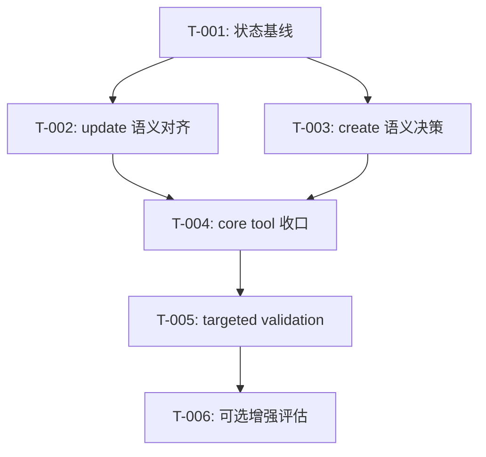

# 开发任务规格文档

## 文档信息
- **功能名称**：zmemory
- **版本**：1.0
- **创建日期**：2026-03-29
- **作者**：Scrum Master Agent
- **关联故事**：`.agents/zmemory/prd.md`

## 摘要

> 下游 Agent 请优先阅读本节，需要细节时再查阅完整文档。

- **任务总数**：6 个任务
- **前端任务**：0 个
- **后端任务**：6 个（含 crate/CLI/core/文档/测试）
- **关键路径**：状态基线 -> crate 语义对齐 -> CLI/core 适配 -> targeted tests
- **关键路径**：状态基线 -> crate 语义对齐 -> CLI/core 适配 -> export 薄封装 -> targeted tests
- **预估复杂度**：中

---

## 1. 任务概览

### 1.1 统计信息
| 指标 | 数量 |
|------|------|
| 总任务数 | 6 |
| 创建文件 | 0 |
| 修改文件 | 9-14 |
| 测试用例 | 8+ |

### 1.2 任务分布
| 复杂度 | 数量 |
|--------|------|
| 低 | 2 |
| 中 | 3 |
| 高 | 1 |

---

## 2. 任务详情

### Story: S-001 - 建立 zmemory 对齐基线并可持续推进

---

#### Task T-001：登记 upstream sync 基线与本地状态

**类型**：修改

**目标文件**：
| 文件路径 | 操作 | 说明 |
|----------|------|------|
| `.codex/skills/sync-zmemory-upstream/STATE.md` | 修改 | 记录上游 hash、当前仅文档对齐的状态 |
| `.agents/zmemory/.meta/execution.json` | 修改 | 标记阶段 1/2 已完成，跳过 UI/部署 |
| `.ai/memory/handoff.md` | 修改 | 记录当前对齐基线与下一步建议 |

**实现步骤**：
1. 将上游参考 hash `912d1deb47334a4241d99d4aa0ce917ee62b9786` 记录进 sync state。
2. 标记这是“文档基线已收口、代码 baseline 尚未推进”的 selective sync。
3. 更新 `.agents/zmemory/.meta/execution.json`，使后续会话可从阶段 3 或定制实施继续。

**测试用例**：

文件：人工检查 + `git diff`

| 用例 ID | 描述 | 类型 |
|---------|------|------|
| TC-001-1 | state 文档包含上游 hash 与 selective sync 说明 | 文档验证 |
| TC-001-2 | execution 元数据与当前文档状态一致 | 文档验证 |

**复杂度**：低

**依赖**：无

**注意事项**：
- 不要把“文档对齐”误记为“代码已完成同步”。
- 不要覆盖用户已有无关 handoff 内容。

**完成标志**：
- [ ] 状态文件更新完成
- [ ] 元数据更新完成
- [ ] 交接信息已补充

---

#### Task T-002：设计并实现 `update` 细粒度语义对齐

**类型**：修改

**目标文件**：
| 文件路径 | 操作 | 说明 |
|----------|------|------|
| `codex-rs/zmemory/src/tool_api.rs` | 修改 | 扩展参数结构 |
| `codex-rs/zmemory/src/service.rs` | 修改 | 支持 `old-string/new-string/append` 或明确兼容策略 |
| `codex-rs/cli/src/zmemory_cmd.rs` | 修改 | 暴露新参数 |
| `codex-rs/zmemory/README.md` | 修改 | 更新 CLI 用法 |

**实现步骤**：
1. 参考上游 `update_memory` 语义，确定本地参数模型。
2. 在 crate 层先实现 patch / append / metadata-only 的行为。
3. 再同步 CLI 参数与帮助文案。
4. 若不完全对齐，也要把保留差异显式写入 README/文档。

**测试用例**：

文件：`codex-rs/zmemory/src/service.rs`、`codex-rs/cli/tests/zmemory.rs`

| 用例 ID | 描述 | 类型 |
|---------|------|------|
| TC-002-1 | old-string/new-string patch 成功并生成新版本 | 单元测试 |
| TC-002-2 | append 支持 whitespace-only 内容 | 单元测试 |
| TC-002-3 | metadata-only update 不产生新 memory row | 单元测试 |
| TC-002-4 | CLI 参数能驱动新语义 | 集成测试 |

**复杂度**：高

**依赖**：T-001

**注意事项**：
- 必须保持 `deprecated/migrated_to` 版本链正确。
- 每次内容变更后都要验证搜索索引刷新行为。

**完成标志**：
- [ ] crate 语义实现完成
- [ ] CLI 适配完成
- [ ] 针对性测试通过

---

#### Task T-003：评估并实现 `create` 接口 parentUri/title 兼容扩展

**类型**：修改

**目标文件**：
| 文件路径 | 操作 | 说明 |
|----------|------|------|
| `codex-rs/zmemory/src/tool_api.rs` | 修改 | 如需要，新增 `parentUri`/`title` |
| `codex-rs/zmemory/src/service.rs` | 修改 | 实现 title -> 路径段语义 |
| `codex-rs/cli/src/zmemory_cmd.rs` | 修改 | 调整 create 命令参数 |
| `.agents/zmemory/architecture.md` | 修改 | 若有重大设计取舍，同步文档 |

**实现步骤**：
1. 确定兼容扩展策略：在存在 `parentUri` 时按上游规则拼接路径（`title` 非空需匹配 `^[a-zA-Z0-9_-]+$`、空值自动编号），否则沿用 `uri` + `content` 旧入口。
2. 在 `tool_api`/`service` 中新增 `parent_uri`、`title` 字段（可选），并保持 `priority`/`disclosure` 的现有选项。
3. CLI 增加 `--parent-uri`/`--title` 参数，`create` 命令能在两种模式间切换；相关 doc/QA 报告记录两种行为。
4. 补充验证：在 CLI 集成测试中运行 `cargo run -p codex-cli -- zmemory create --parent-uri ...` 并检查 JSON 输出确保路径生成正确。

**测试用例**：

文件：`codex-rs/zmemory/src/service.rs`、`codex-rs/cli/tests/zmemory.rs`

| 用例 ID | 描述 | 类型 |
|---------|------|------|
| TC-003-1 | create 同时支持 URI 模式与 parentUri/title 模式 | 单元测试 |
| TC-003-2 | title 为空时自动编号、非法字符会报尝 | 单元测试 |
| TC-003-3 | CLI create 命令（`--parent-uri + --title`）的 JSON 输出与 path 生成正确 | CLI 集成测试 |

**复杂度**：中

**依赖**：T-001

**注意事项**：
- 不要为了追 parity 破坏当前已有调用方式，除非有明确迁移策略。

**完成标志**：
- [ ] 已做接口决策
- [ ] 文档与实现一致
- [ ] 回归测试补齐

#### Task T-003A：实现本地 CLI-only `export` 视图导出

**类型**：修改

**目标文件**：
| 文件路径 | 操作 | 说明 |
|----------|------|------|
| `codex-rs/zmemory/src/system_views.rs` | 修改 | 支持 `system://index/<domain>` 与 `system://recent/<n>` |
| `codex-rs/cli/src/zmemory_cmd.rs` | 修改 | 增加 `export` 子命令 |
| `codex-rs/cli/tests/zmemory.rs` | 修改 | 补 export 集成测试 |
| `codex-rs/zmemory/README.md` | 修改 | 明确 export 仅为本地 CLI 薄封装 |

**实现步骤**：
1. 参考 upstream `admin export`，只对齐其“导出系统视图”的 CLI 语义，不引入 REST API、daemon 或新的 admin service。
2. 在 crate 侧扩展 system view 路径解析，支持 `index/<domain>` 与 `recent/<n>`。
3. 在 CLI 增加 `zmemory export boot|index|recent|glossary`，内部映射到 `read system://...`。
4. 同步 README、QA 与 sync state，明确这是本地 CLI-only 包装，不是新的远程接口。

**测试用例**：

文件：`codex-rs/zmemory/src/service.rs`、`codex-rs/cli/tests/zmemory.rs`

| 用例 ID | 描述 | 类型 |
|---------|------|------|
| TC-003A-1 | `system://index/<domain>` 能返回 domain-scoped index | 单元测试 |
| TC-003A-2 | `system://recent/<n>` 能按路径 limit 返回 recent view | 单元测试 |
| TC-003A-3 | `zmemory export glossary --json` 返回与 system view 一致的结构 | CLI 集成测试 |
| TC-003A-4 | `zmemory export index --domain core` / `recent --limit 1` 路径映射正确 | CLI 集成测试 |

**复杂度**：低

**依赖**：T-003

**完成标志**：
- [x] crate 视图路径扩展完成
- [x] CLI export 薄封装完成
- [x] 文档与验证同步完成

---

### Story: S-002 - 完成 CLI / core tool 收口与验证

---

#### Task T-004：更新 core tool spec 与 handler 文档化边界

**类型**：修改

**目标文件**：
| 文件路径 | 操作 | 说明 |
|----------|------|------|
| `codex-rs/core/src/tools/spec.rs` | 修改 | 若接口语义变化，更新参数描述 |
| `codex-rs/core/src/tools/spec_tests.rs` | 修改 | 补对齐后的说明与 schema 断言 |
| `codex-rs/core/src/tools/handlers/zmemory.rs` | 修改 | 如有需要，保证输出与错误路径一致 |

**实现步骤**：
1. 若 T-002/T-003 改动了参数合同，先更新 spec。
2. 扩展现有 spec tests，确保描述与 output schema 一致。
3. 保持 core tool 仍为本地嵌入式能力，不扩成上游 MCP server 形态。

**测试用例**：

文件：`codex-rs/core/src/tools/spec_tests.rs`、`codex-rs/core/tests/suite/zmemory_e2e.rs`

| 用例 ID | 描述 | 类型 |
|---------|------|------|
| TC-004-1 | tool 描述继续强调 embedded/local/no daemon | 单元测试 |
| TC-004-2 | 新参数语义在 schema 中可见 | 单元测试 |
| TC-004-3 | e2e 调用输出与错误路径符合预期 | 集成测试 |

**复杂度**：中

**依赖**：T-002 或 T-003

---

#### Task T-005：建立稳定的 targeted validation 套件

**类型**：修改

**目标文件**：
| 文件路径 | 操作 | 说明 |
|----------|------|------|
| `.agents/zmemory/qa-report.md` | 修改 | 记录验证矩阵 |
| `.agents/zmemory/tasks.md` | 修改 | 回写真实执行结果 |
| 可选：`just`/文档脚本 | 修改 | 如需补运行指引 |

**实现步骤**：
1. 固定最小验证集合：
   - `RUSTC_WRAPPER= cargo test -p codex-zmemory`
   - `RUSTC_WRAPPER= cargo test -p codex-cli --test zmemory`
   - `RUSTC_WRAPPER= cargo test -p codex-core --test all zmemory`
2. 记录哪些命令稳定、哪些会超时、哪些需要后续优化。
3. 在 QA 报告中固化“已验证 / 未验证”口径。

**测试用例**：

文件：`.agents/zmemory/qa-report.md`

| 用例 ID | 描述 | 类型 |
|---------|------|------|
| TC-005-1 | QA 文档能反映真实命令和结果 | 文档验证 |
| TC-005-2 | 不再口头声称“都测过了” | 流程验证 |

**复杂度**：低

**依赖**：T-004

---

#### Task T-006：可选增强：admin/export 与 memory skill 接口衔接评估

**类型**：修改/调研

**目标文件**：
| 文件路径 | 操作 | 说明 |
|----------|------|------|
| `codex-rs/zmemory/README.md` | 修改 | 记录增强结论 |
| `.agents/zmemory/tech-review.md` | 修改 | 回写取舍 |
| 相关实现文件 | 可选修改 | 仅在结论明确后进行 |

**实现步骤**：
1. 评估上游 `admin export` 是否真的对本地嵌入式模式有价值。
2. 评估未来与 memory skill 的最小衔接点。
3. 若只是信息收集，不做实现也要有明确结论。

**测试用例**：

文件：文档评审

| 用例 ID | 描述 | 类型 |
|---------|------|------|
| TC-006-1 | 明确记录“要做 / 不做 / 以后再做” | 评审验证 |

**复杂度**：中

**依赖**：T-005

**当前结论**：
- [x] `admin export` 已以本地 CLI-only 形态落地，不再扩成独立 admin service。
- [x] upstream `memory skill` 暂不整包迁入；当前只在 README/tech-review 中固化动作映射与边界。
- [x] 后续若需要真正启用 memory skill，优先在仓库根级 skill/agent 编排层实现，而不是扩张 `codex-zmemory` crate。
- [x] alias/trigger parity 新增：`stats`、`doctor` 现在能报告 alias node/trigger counts 与 alias-without-triggers 警告，CLI tests/QA 文档同步验证。
- [x] repo-root memory skill references 补齐 project-init/review/recall recipes，skill 继续用现有 `codex zmemory` 命令即可。
- [x] 下一轮 parity audit 已选定 review/admin 信号缺口：优先补 `stats` / `doctor` 的 orphaned/deprecated 治理信号，而不是新增 review 服务。

---

## 3. 实现前检查清单

在开始实现前，确保：

- [ ] 已阅读 `.agents/zmemory/prd.md`
- [ ] 已阅读 `.agents/zmemory/architecture.md`
- [ ] 已阅读 `.agents/zmemory/tech-review.md`
- [ ] 已确认本轮只做一个小范围对齐目标
- [ ] 已准备最小验证命令
- [ ] 已检查仓库脏改动，避免误提交无关文件

---

## 4. 任务依赖图

---

## 5. 文件变更汇总

### 5.1 核心文件
| 文件路径 | 关联任务 | 说明 |
|----------|----------|------|
| `codex-rs/zmemory/src/tool_api.rs` | T-002, T-003 | 参数模型与对外合同 |
| `codex-rs/zmemory/src/service.rs` | T-002, T-003 | 核心语义实现 |
| `codex-rs/cli/src/zmemory_cmd.rs` | T-002, T-003 | CLI 参数映射 |
| `codex-rs/core/src/tools/spec.rs` | T-004 | core tool schema/文案 |
| `codex-rs/core/src/tools/spec_tests.rs` | T-004 | spec 回归 |
| `codex-rs/core/tests/suite/zmemory_e2e.rs` | T-004 | function tool e2e |
| `codex-rs/cli/tests/zmemory.rs` | T-002, T-003, T-005 | CLI 回归 |
| `.codex/skills/sync-zmemory-upstream/STATE.md` | T-001 | 上游同步状态 |
| `.agents/zmemory/qa-report.md` | T-005 | 验证记录 |

### 5.2 测试文件
| 文件路径 | 关联任务 | 测试类型 |
|----------|----------|----------|
| `codex-rs/zmemory/src/service.rs` | T-002, T-003 | 单元测试 |
| `codex-rs/cli/tests/zmemory.rs` | T-002, T-003, T-005 | CLI 集成测试 |
| `codex-rs/core/src/tools/spec_tests.rs` | T-004 | 单元测试 |
| `codex-rs/core/tests/suite/zmemory_e2e.rs` | T-004 | core e2e |

---

## 6. 代码规范提醒

### Rust
- 优先在 `codex-rs/zmemory` 核心层做根因修复，不在 CLI/core 适配层打补丁。
- 保持参数自解释，避免继续扩张难读的布尔/空值位置参数。
- 如果接口形状不能完全向上游靠拢，必须在文档里记录理由。

### 测试
- 先跑最窄最可靠的验证。
- 每轮任务完成后至少补一条覆盖新增语义的测试。
- 如果 CLI/core 大测试跑不完，必须在 QA 文档中明确写出未验证项。

---

## 变更记录

| 版本 | 日期 | 作者 | 变更内容 |
|------|------|------|----------|
| 1.0 | 2026-03-29 | Scrum Master Agent | 基于本地现状与上游参考重写 zmemory 实施任务拆解 |
